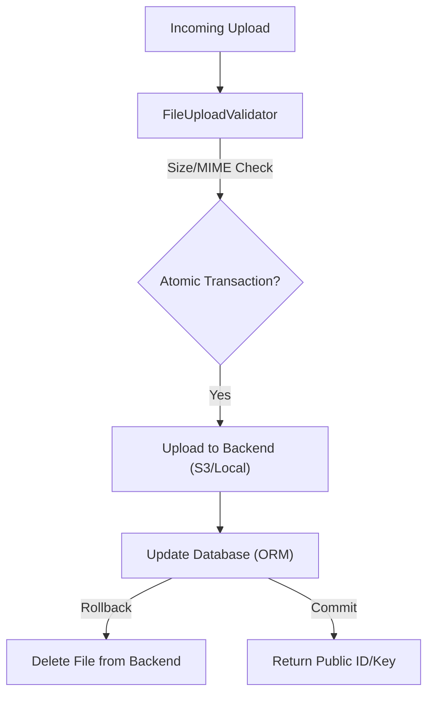

# 📁 File Storage & Object Persistence

**Eden provides a unified, industrial-grade storage abstraction. Whether you are serving local media or managing petabytes in AWS S3, Eden ensures your file operations are atomic, secure, and developer-friendly.**

---

## 🧠 The Eden Storage Pipeline

The storage system is built around a **Pluggable Backend** architecture. Your application interacts with a standard `StorageManager` that routes operations to the active provider (Local, S3, or Supabase) while enforcing security and atomicity.



---

## 🏗️ Storage Backends

Eden supports multiple backends. You can register several and switch between them dynamically (e.g., `local` for dev, `s3` for prod).

| Backend | Typical Use | Driver |
| :--- | :--- | :--- |
| **`LocalStorageBackend`** | Local development / Single server | `aiofiles` |
| **`S3StorageBackend`** | Production / Scalable / SaaS | `aioboto3` |

### Registration Pattern
Register backends during your application bootstrap.

```python
from eden.storage import storage, LocalStorageBackend
from eden.storage_backends import S3StorageBackend

# 1. Dev: Save to local disk
storage.register("local", LocalStorageBackend(base_path="./media"), default=True)

# 2. Prod: Save to high-performance S3
if app.env == "production":
    storage.register("s3", S3StorageBackend(
        bucket="my-data-bucket",
        region="us-east-1"
    ), default=True)
```

---

## 🛡️ Industrial Security: `FileUploadValidator`

Never trust user-supplied files. Eden's validator provides deep inspection—including size limits, type whitelists, and optional virus scanning—before a single byte hits your storage.

```python
from eden.storage import FileUploadValidator

# Create a strict policy for profile images
policy = FileUploadValidator(
    max_size_bytes=5 * 1024 * 1024,  # 5MB Max
    allowed_types={"image/jpeg", "image/png", "image/webp"},
    enable_virus_scan=True  # Optional: Requires pyclamd + ClamAV
)

# Usage in your view
file_key = await storage.get().save(request.files['avatar'], validator=policy)
```

---

## ⚡ Elite Usage Patterns

### 1. Atomic Storage Transactions
A common "Gotcha" in web apps: a file is uploaded to S3, but the database save fails, leaving an orphaned file. Eden's `AtomicStorageTransaction` ensures that if your database save fails, the file is automatically deleted from storage.

```python
async with storage.transaction() as txn:
    # 1. Save file (tracked by transaction)
    key = await txn.save(upload_file, folder="invoices")
    
    # 2. Update Database
    invoice = await Invoice.create(file_key=key, amount=100.0)
    # If an error happens here, 'key' is auto-deleted from S3!
```

### 2. High-Performance: Client-Side Direct Uploads
For high-traffic apps, don't proxy files through your server. Generate a **Presigned URL** and let the user's browser upload directly to S3.

```python
@app.get("/storage/presign")
async def get_upload_url(request):
    # Generates a temporary URL valid for 1 hour
    url = await storage.get().presigned_url(
        name=f"uploads/{uuid.uuid4().hex}.jpg",
        expires_in=3600
    )
    return {"upload_url": url}
```

### 3. Protected Content: Private URLs
Keep sensitive documents (PDFs, Invoices) in a private bucket and only grant temporary access via presigned download links.

```python
@app.get("/invoices/{id}/download")
async def download_invoice(request, id: int):
    invoice = await Invoice.get(id=id)
    # Return a 5-minute temporary link
    return RedirectResponse(
        await storage.get().presigned_url(invoice.file_key, expires_in=300)
    )
```

---

## 📄 API Reference

### `StorageManager` (`eden.storage.storage`)

| Method | Returns | Description |
| :--- | :--- | :--- |
| `save(content, **kwargs)` | `str` | Saves file to default backend and returns the primary key. |
| `url(key)` | `str` | Returns the absolute public URL for a given file key. |
| `delete(key)` | `None` | Permanently removes a file from the backend. |
| `presigned_url(key, expires_in)` | `str` | Generates a temporary signed URL for binary data. |

---

## 💡 Best Practices

1. **Unique Keys**: Eden auto-generates unique names to prevent collisions. Do not use raw user filenames.
2. **Partitioning**: Use the `folder` parameter (e.g., `folder="users/avatars"`) to organize your buckets cleanly.
3. **N+1 Prevention**: In your ORM, store only the `file_key`. Use a property to resolve the absolute URL on-the-fly: `self.storage.url(self.avatar_key)`.

---

**Next Steps**: [Background Tasks & Task Queues](background-tasks.md) | [SaaS Multi-Tenancy](tenancy-postgres.md)
