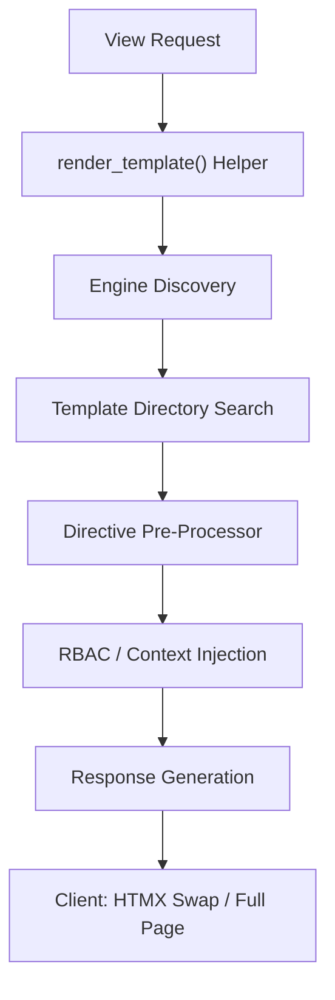
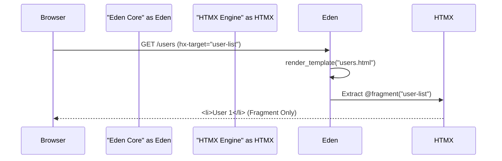

# 🎨 Premium Templating Engine

**Design high-performance, dynamic UIs with ease. Eden features a specialized templating engine built for speed, HTMX integration, and industrial-scale productivity.**

---

## 🧠 Conceptual Overview

Eden's templating system is more than just HTML rendering; it's a **UI Orchestrator**. It translates a clean, brace-based `@directive` syntax (inspired by Blade and Lara-esque patterns) into optimized Jinja2 code, while providing deep integration with Eden's security and HTMX layers.

### The Rendering Pipeline



### How it Works (Visualized)

When an HTMX request comes in with an `HX-Target` header matching a fragment name, Eden intercepts the render and extracts only that specific node.



---

## 🏗️ Configuration & Architecture

The template engine is initialized during application bootstrap. You can configure the directory either in `eden.json` or directly in the constructor.

```python
from eden import Eden

# Recommended: Constructor configuration

app = Eden(template_dir="templates")
```

> [!IMPORTANT]
> **Static Initialization**: The template engine is a "sealed" component. Configure it during bootstrap; changing `app.template_dir` after the app starts will not reconstruct the engine.

---

## 🌊 The `render_template` Helper

The `render_template` helper is the primary way to return HTML. It is HTMX-aware and handles context injection automatically.

```python
from eden import render_template

@app.get("/dashboard")
async def dashboard(request):
    stats = await get_stats()
    return render_template("dashboard.html", stats=stats)
```

### Automatic Context Injection

Eden automatically injects the following into every template context:

- `request`: The current `Request` object.
- `user`: The current authenticated user (sourced from `request.state.user`).
- `csrf_token`: Accessible via `csrf_token()`.
- `eden_messages`: Flash messages and toasts.

---

## 🗺️ Navigation & Active States

Building consistent, stateful navigation is trivial with the `@active_link` directive. It automatically determines if a route is "active" and manages your CSS classes accordingly.

### Declarative Route Highlighting

The `@active_link` directive supports exact route names, wildcard sections (`*`), and **State Toggling** via an optional third parameter.

```html
<nav>
    <!-- Use route names with @active_link and @url -->
    <a href="@url('home')" 
       class="@active_link('home', 'is-active', 'is-inactive')">Home</a>
       
    <!-- Wildcards match any sub-route in a namespace -->
    <a href="@url('admin:index')" 
       class="@active_link('admin:*', 'admin-active')">Settings</a>
</nav>
```

- **Parameter 1**: The route name or pattern (e.g., `'dashboard'`, `'posts:*'`).
- **Parameter 2**: The CSS class(es) to apply when the route is active.
- **Parameter 3**: (Optional) The CSS class(es) to apply when the route is **not** active.

### Premium UI Implementation

For premium design systems (like side-navigation with borders and gradients), use the 3-argument syntax to cleanly swap entire style sets:

```html
<nav class="sidebar">
    <a href="@url('dashboard')"
       class="flex items-center p-3 rounded-lg transition-all 
              @active_link('dashboard', 
                  'text-lime-400 border-r-4 border-lime-400 bg-lime-400/10', 
                  'text-gray-500 hover:bg-gray-800'
              )">
        <span class="material-symbols-outlined">dashboard</span>
        <span>Dashboard</span>
    </a>
</nav>
```

---

## 📦 Asset Management & Stacking

Eden uses a **Stacking** system to manage assets. This allows a sub-template to "push" scripts or styles into the layout without complex block inheritance.

### The Layout (`base.html`)

```html
<html>
<head>
    @eden_head
    @stack('head')
</head>
<body>
    @yield('content')
    
    @eden_scripts
    @stack('scripts')
</body>
</html>
```

### The Page (`profile.html`)

```html
@extends('base.html')

@section('content')
    <h1>User Profile</h1>
@endsection

@push('scripts')
    <script src="/js/charts.js"></script>
    <script>
        initCharts();
    </script>
@endpush

@pushOnce('head')
    <link rel="stylesheet" href="/css/profile-dark.css">
@endpushOnce
```

- **`@push(name)`**: Appends content to the named stack.
- **`@prepend(name)`**: Prepends content to the start of the stack.
- **`@pushOnce(name)`**: Ensures the content is only pushed once, even if the template is included multiple times.

---

## 🧩 Advanced Components

For complex UI, use the `@component` directive. It supports slots and declarative props.

### 1. Define the Component (`components/card.html`)

```html
@props(['title', 'status' => 'active'])

<div class="card card-{{ status }}">
    @if(title)
        <div class="card-header">{{ title }}</div>
    @endif
    
    <div class="card-body">
        {{ slot }}
    </div>
</div>
```

### 2. Use the Component

```html
@component('card', title="Project Alpha", status="urgent")
    <p>This project requires immediate attention.</p>
@endcomponent
```

---

## ⚡ HTMX Fragments

Instead of creating hundreds of partial files, use the `@fragment` directive to define specific sections of a template that can be rendered independently.

### The Template (`items.html`)

```html
<ul>
    @foreach(items as item)
        @fragment('item-row')
            <li id="item-{{ item.id }}">
                {{ item.name }}
                <button hx-delete="/items/{{ item.id }}" hx-target="closest li">Delete</button>
            </li>
        @endfragment
    @endforeach
</ul>
```

### The Backend

```python
@app.delete("/items/{id}")
async def delete_item(request, id: int):
    # Logic to delete item...
    return "" # Or return a different fragment
```

---

## 🛠️ Utility Directives

| Directive | Purpose | Example |
| :--- | :--- | :--- |
| `@dump` | High-fidelity object inspector (Premium UI). | `@dump(user)` |
| `@inject` | Injects a service via Dependency Injection. | `@inject('stats', 'ProjectService')` |
| `@let` | Assigns a local variable in the template. | `@let(full_name = user.first + " " + user.last)` |
| `@json` | Safely encodes an object to JSON for JS usage. | `const data = @json(stats);` |
| `@vite` | Injects Vite HMR scripts and entry points. | `@vite(['js/app.js', 'css/app.css'])` |

---

## 🛡️ Security & RBAC

Directives are deeply integrated with Eden's Core Security.

```html
@auth
    @can('projects.edit')
        <button class="btn">Edit Project</button>
    @endcan
    
    @role('admin')
        <a href="/admin">Admin Panel</a>
    @endrole
@else
    <a href="/login">Login</a>
@endauth
```

---

## 💡 Best Practices

1. **Layout Granularity**: Use `@push` for page-specific JS instead of creating massive global bundles.
2. **Fragment Strategy**: Use `@fragment` for HTMX updates to keep your logic contained within a single context.
3. **Inject Sparingly**: Prefer passing data through the view controller, but use `@inject` for persistent UI elements like "Latest Notifications".
4. **Premium Debugging**: Use `@dump` in development! It renders a sleek, themed inspector that handles deep nesting better than standard print.

---

**Next Steps**: [High-Fidelity Forms (Validation)](forms.md)
