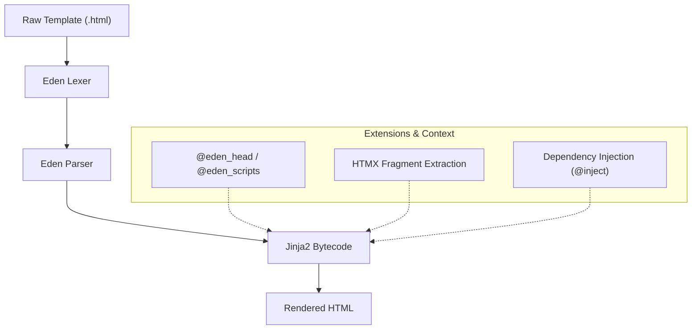
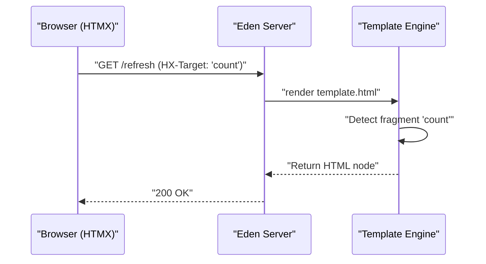

# Eden Templating Engine Documentation

> **Modern, Powerful, Express-Inspired Syntax for Web Templates**

Eden's templating engine is a state-of-the-art templating system designed for maximum readability and performance. It translates a clean, brace-based `@directive` syntax (inspired by Blade and JavaScript frameworks) into optimized Jinja2 code.

**Key Features:**

- **40+ Directives**: Covering control flow, forms, authorization, and fragment rendering.
- **35+ Built-in Filters**: For string manipulation, currency, date formatting, and more.
- **HTMX Auto-Fragment Detection**: Render only the changed part of a page automatically.
- **Premium Design System**: Injected CSS variables and utility classes for a "wow" aesthetic.
- **Type-Safe Dynamic URLs**: Built-in `@url()` directive with named route support.

---

## The Architecture
Eden uses a custom lexer and parser to transform a clean, developer-friendly `@directive` syntax into optimized Jinja2 bytecode. This allows for a "Modern Web" feel without sacrificing the performance of a mature engine.



---

## Table of Contents

1. [Rendering Templates](#rendering-templates)
2. [Quick Start Guide](#quick-start-guide)
3. [Control Flow Directives](#control-flow-directives)
4. [Design System and Assets](#design-system-and-assets)
5. [HTMX and Fragments](#htmx-and-fragments)
6. [Global Variables and Helpers](#global-variables-and-helpers)
7. [Filters Reference](#filters-reference)
8. [Component Patterns](#component-patterns)

---

## Rendering Templates

Eden provides multiple ways to render templates, providing flexibility for different routing styles.

### 1. Using `@app.get` (Magic Return)

Eden route handlers can return templates directly using the `render()` method of the `Eden` application.

```python
@app.get("/")
async def home(request):
    return app.render(request, "home.html", {"title": "Welcome"})
```

### 2. The `render_template()` Helper (Standard)

For the most ergonomic experience, use the `render_template` shortcut. It automatically discovers the current request context using Python context variables.

```python
from eden import render_template

@app.get("/profile/{username}")
async def profile(username: str):
    user = await User.get_by_username(username)
    return render_template("profile.html", user=user)
```

> [!TIP]
> `render_template` is the preferred way to render HTML in Eden. It handles HTMX fragment detection and injects the `request`, `user`, and `current_tenant` into your template context automatically.

---

## Quick Start Guide

Eden uses a brace-based syntax for logic and double curly braces for interpolation.

| Feature | Syntax | Description |
| :--- | :--- | :--- |
| **Interpolation** | `{{ user.name }}` | Renders the result of a Python expression (auto-escaped). |
| **Directives** | `@directive(args)` | Control flow or built-in helper functions. |
| **Blocks** | `@{ ... }` | Multi-line logic blocks (rarely needed). |
| **Raw Output** | `{{ html \| safe }}` | Renders unescaped HTML content. |

---

## Control Flow Directives

### Conditional Logic

```html
@if(user.is_admin) {
    <div class="admin-badge">Admin</div>
} @else_if(user.is_moderator) {
    <div class="mod-badge">Moderator</div>
} @else {
    <div class="user-badge">User</div>
}
```

### Authentication Guards
A cleaner way to handle user states:

```html
@auth {
    <p>Welcome back, {{ user.name }}!</p>
} @guest {
    <a href="/login">Sign In</a>
}
```

## Form Logic Integration
### Looping & Iteration
Eden's `@for` loop includes an optional `@empty` block for graceful empty states.

```html
<ul class="user-list">
    @for(user in users) {
        <li class="@even { bg-slate-800 } @odd { bg-slate-900 }">
            {{ user.name }} ({{ $loop.index }} of {{ $loop.length }})
        </li>
    } @empty {
        <li class="p-4 text-center text-slate-500">No users found.</li>
    }
</ul>
```

---

## Design System and Assets

Eden injects a premium design system by default. Use the `@eden_head` and `@eden_scripts` directives to activate it.

### Foundation Directives

- **`@eden_head`**: Injects `<head>` metadata, Tailwind v4, Jakarta Sans & Outfit fonts, and premium CSS variables (glassmorphism, obsidian theme).
- **`@eden_scripts`**: Injects the Eden runtime, auto-CSRF for HTMX, and the `eden-sync` real-time websocket extension.

```html
<!DOCTYPE html>
<html>
<head>
    @eden_head
    <title>@yield("title")</title>
</head>
<body class="bg-slate-950">
    @yield("content")
    @eden_scripts
</body>
</html>
```

### Design Tokens (Filters)

Eden provides filters to quickly apply brand-consistent styling.

| Filter | Example | Result (Tailwind Classes) |
| :--- | :--- | :--- |
| `eden_bg` | `{{ 'primary' \| eden_bg }}` | `bg-emerald-600` |
| `eden_text` | `{{ 'danger' \| eden_text }}` | `text-red-500` |
| `eden_shadow` | `{{ 'lg' \| eden_shadow }}` | `shadow-lg shadow-black/20` |

---

## HTMX and Fragments

### Auto-Fragment Swaps

Eden eliminates the need for manual partial templates. Wrap dynamic regions in `@fragment("name")`. If HTMX requests that fragment specifically (via `HX-Target`), Eden renders **only** that block.

```html
<div id="user-count">
    @fragment("count") {
        <span>{{ total_users }} Users Online</span>
    }
</div>
|
<button hx-get="/refresh" hx-target="#user-count">
    Update Count
</button>
```

---

### How it Works (Visualized)

When an HTMX request comes in with an `HX-Target` header matching a fragment name, Eden intercepts the render and extracts only that specific node.



---

---

## Filters Reference

### String Manipulation

- **`| upper` / `| lower`**: Case conversion.
- **`| truncate(n)`**: Truncate to $n$ characters with `…`.
- **`| slugify`**: URL-safe slug generation.
- **`| mask`**: Mask sensitive info (e.g. `u***@e.com`).

### Formatting

- **`| money`**: Format as currency (e.g., `$1,250.00`).
- **`| date(format)`**: Standard Jinja date formatting.
- **`| time_ago`**: Human-readable relative time (e.g., "3 hours ago").

### Form & Logic

- **`| add_class('cls')`**: Append CSS class to a form field.
- **`| attr('rows', 5)`**: Add HTML attribute to a field.
- **`@json(val)`**: Serialize Python object for use in JavaScript.

---

## Component Patterns

### Elite Pattern: The Data Table

Data tables often require complex logic. Combine `@for`, `@empty`, and `@fragment` for a robust implementation.

```html
@fragment("users-table") {
    <div class="glass rounded-xl overflow-hidden border border-white/10">
        <table class="w-full">
            <thead class="bg-white/5 border-b border-white/10">
                <tr>
                    <th class="p-4 text-left">User</th>
                    <th class="p-4 text-left">Role</th>
                    <th class="p-4 text-right">Actions</th>
                </tr>
            </thead>
            <tbody>
                @for(user in users) {
                    <tr class="hover:bg-white/5 transition">
                        <td class="p-4">
                            <div class="font-medium">{{ user.name }}</div>
                            <div class="text-xs text-slate-400">{{ user.email }}</div>
                        </td>
                        <td class="p-4">
                            <span class="px-2 py-1 rounded text-xs {{ 'bg-blue-500/20 text-blue-400' if user.is_admin else 'bg-slate-500/20 text-slate-400' }}">
                                {{ user.role }}
                            </span>
                        </td>
                        <td class="p-4 text-right">
                            <button hx-delete="@url('users:delete', id=user.id)" 
                                    hx-confirm="Delete {{ user.name }}?"
                                    class="text-red-400 hover:text-red-300">
                                <i class="fa fa-trash"></i>
                            </button>
                        </td>
                    </tr>
                } @empty {
                    <tr>
                        <td colspan="3" class="p-12 text-center text-slate-500 italic">
                            No matching users found in your tenant.
                        </td>
                    </tr>
                }
            </tbody>
        </table>
    </div>
}
```

---

## All Filters Reference

Eden provides a rich set of built-in filters for formatting, transforming, and styling data. **All examples below use the pipe (`|`) syntax.**

---

### String Filters

#### **upper** - Convert to uppercase

```html
{{ name | upper }}
{{ "hello" | upper }}  <!-- Output: HELLO -->
{{ user.email | upper }}
```

#### **lower** - Convert to lowercase

```html
{{ NAME | lower }}
{{ "WELCOME" | lower }}  <!-- Output: welcome -->
{{ title | lower }}
```

#### **title** - Title case (first letter capitalized)

```html
{{ name | title }}
{{ "python developer" | title }}  <!-- Output: Python Developer -->
{{ text | title }}
```

#### **capitalize** - Capitalize first character only

```html
{{ name | capitalize }}
{{ "first name" | capitalize }}  <!-- Output: First name -->
{{ description | capitalize }}
```

#### **reverse** - Reverse a string

```html
{{ text | reverse }}
{{ "hello" | reverse }}  <!-- Output: olleh -->
{{ code | reverse }}
```

#### **trim / ltrim / rtrim** - Remove whitespace

```html
{{ text | trim }}      <!-- Remove both sides -->
{{ text | ltrim }}     <!-- Remove left -->
{{ text | rtrim }}     <!-- Remove right -->
{{ "  hello  " | trim }}  <!-- Output: hello -->
```

#### **replace** - Replace substring

```html
{{ text | replace("oldtext", "newtext") }}
{{ "Hello World" | replace("World", "Eden") }}  <!-- Output: Hello Eden -->
{{ path | replace("/", "-") }}
```

#### **slice** - Extract substring

```html
{{ text | slice(0, 5) }}
{{ "Hello World" | slice(0, 5) }}  <!-- Output: Hello -->
{{ email | slice(0, 3) }}  <!-- Hide most of email -->
```

#### **length** - Get string length
```html
{{ text | length }}
{{ "hello" | length }}  <!-- Output: 5 -->
{{ description | length }}
```

#### **truncate** - Truncate with ellipsis
```html
{{ text | truncate(20) }}
{{ "This is a very long description" | truncate(15) }}  <!-- Output: This is a very... -->
{{ post.content | truncate(50) }}
{{ bio | truncate(100, "...") }}  <!-- Custom suffix -->
```

#### **repeat** - Repeat string N times
```html
{{ text | repeat(3) }}
{{ "*" | repeat(5) }}  <!-- Output: ***** -->
{{ "-" | repeat(20) }}
{{ emoji | repeat(4) }}
```

#### **slugify** - Convert to URL-safe slug

```html
{{ title | slugify }}
{{ "Hello World!" | slugify }}  <!-- Output: hello-world -->
{{ "Python™ Developer" | slugify }}  <!-- Output: python-developer -->
{{ post.title | slugify }}
```

#### **title_case** - Uppercase first letter of each word

```html
{{ text | title_case }}
{{ "python web framework" | title_case }}  <!-- Output: Python Web Framework -->
{{ "john doe" | title_case }}  <!-- Output: John Doe -->
{{ name | title_case }}
```

#### **mask** - Mask sensitive information

```html
{{ email | mask }}  <!-- Output: u***@example.com -->
{{ phone | mask('*', 4) }}  <!-- Output: ****1234 -->
{{ ssn | mask('X') }}  <!-- Mask with X: XXX-XX-1234 -->
{{ credit_card | mask('*', 4) }}  <!-- Show last 4 digits -->
```

#### **default_if_none** - Fallback value if None

```html
{{ user.phone | default_if_none("Not provided") }}
{{ data | default_if_none("N/A") }}
{{ optional_field | default_if_none("-") }}
{{ missing_value | default_if_none("Unknown") }}
```

#### **pluralize** - Add suffix based on count

```html
{{ count | pluralize("item") }}  <!-- "1 item" or "5 items" -->
{{ 1 | pluralize("person") }}  <!-- Output: person -->
{{ 5 | pluralize("person") }}  <!-- Output: persons -->
You have {{ notifications | pluralize("notification") }}
```

---

### Numeric Filters

#### **abs** - Absolute value

```html
{{ number | abs }}
{{ -42 | abs }}  <!-- Output: 42 -->
{{ temperature | abs }}
{{ -100 | abs }}  <!-- Output: 100 -->
```

#### **round** - Round to N decimal places

```html
{{ price | round }}
{{ 3.14159 | round(2) }}  <!-- Output: 3.14 -->
{{ value | round(0) }}  <!-- Round to integer -->
{{ 19.99 | round }}  <!-- Output: 20 -->
```

#### **ceil** - Round up (ceiling)

```html
{{ price | ceil }}
{{ 3.2 | ceil }}  <!-- Output: 4 -->
{{ value | ceil }}
{{ 10.1 | ceil }}  <!-- Output: 11 -->
```

#### **floor** - Round down

```html
{{ price | floor }}
{{ 3.9 | floor }}  <!-- Output: 3 -->
{{ items | floor }}
{{ 19.99 | floor }}  <!-- Output: 19 -->
```

---

### Array/List Filters

#### **first** - Get first element

```html
{{ items | first }}
{{ [1, 2, 3] | first }}  <!-- Output: 1 -->
{{ users | first }}
```

#### **last** - Get last element

```html
{{ items | last }}
{{ [1, 2, 3] | last }}  <!-- Output: 3 -->
{{ comments | last }}
```

#### **unique** - Remove duplicates

```html
{{ items | unique }}
{{ [1, 2, 2, 3] | unique }}  <!-- Output: [1, 2, 3] -->
{{ tags | unique }}
{{ list | unique }}
```

#### **sort** - Sort array

```html
{{ items | sort }}
{{ [3, 1, 2] | sort }}  <!-- Output: [1, 2, 3] -->
{{ names | sort }}
@for(item in items | sort) { ... }
```

#### **reverse_array** - Reverse array order

```html
{{ items | reverse_array }}
{{ [1, 2, 3] | reverse_array }}  <!-- Output: [3, 2, 1] -->
{{ comments | reverse_array }}
@for(item in posts | reverse_array) { ... }
```

---

### Time & Date Filters

#### **date** - Format date/datetime

```html
{{ created_at | date("%Y-%m-%d") }}
{{ now | date("%B %d, %Y") }}  <!-- Output: March 13, 2026 -->
{{ birthday | date("%d/%m/%Y") }}
{{ timestamp | date("%Y-%m-%d %H:%M") }}
```

#### **time** - Format time only

```html
{{ clock | time("%H:%M:%S") }}
{{ now | time("%I:%M %p") }}  <!-- Output: 02:30 PM -->
{{ scheduled_at | time("%H:%M") }}
{{ created_at | time("%H:%M:%S.%f") }}
```

#### **time_ago** - Human-readable time distance

```html
{{ created_at | time_ago }}
{{ post.published | time_ago }}  <!-- Output: 2 hours ago -->
{{ comment.created_at | time_ago }}  <!-- Output: just now, 5 minutes ago, etc. -->
Posted {{ last_login | time_ago }}
```

#### **file_size** - Format bytes to human-readable

```html
{{ file.size | file_size }}
{{ 1024 | file_size }}  <!-- Output: 1.0 KB -->
{{ 1048576 | file_size }}  <!-- Output: 1.0 MB -->
{{ bytes | file_size }}  <!-- Output: 2.5 GB -->
Download ({{ attachment.bytes | file_size }})
```

---

### Currency & International  

#### **money / currency** - Format as currency

```html
{{ price | currency }}  <!-- US dollar default -->
{{ 99.99 | currency }}  <!-- Output: $99.99 -->
{{ amount | currency("USD") }}
{{ total | money }}  <!-- Alias for currency -->
Total: {{ cart.total | money }}
```

#### **phone** - Format phone number

```html
{{ phone | phone }}
{{ "5551234567" | phone }}  <!-- Output: (555) 123-4567 -->
{{ number | phone("US") }}
{{ contact.mobile | phone }}
```

---

### Type Conversion

#### **json / json_encode** - JSON serialization

```html
{{ data | json }}
{{ user | json }}  <!-- Safe for JS: -->
```

```html
<script>
  const user = @json(user);  <!-- Becomes: {"id": 1, "name": "John"} -->
  const data = @output(item | json);
</script>
```

```html
@json({ key1: value1, key2: value2 })
```

---

### Widget and Form Tweaks

Transform form field objects inline. These are **independent of `@render_field`** and work with field dictionaries.

#### **add_class** - Append CSS class to field
```html
{{ form['email'] | add_class('border-red') }}
{{ form['input'] | add_class('w-full') | add_class('rounded') }}
@if(errors.has('name')) {
    {{ form['name'] | add_class('error') }}
}
{{ field | add_class('active') }}
```

#### **attr** - Set field attribute
```html
{{ form['description'] | attr('rows', '8') }}
{{ form['email'] | attr('placeholder', 'email@example.com') }}
{{ form['password'] | attr('minlength', '8') | attr('autocomplete', 'off') }}
{{ input | attr('data-validate', 'email') }}
```

#### **append_attr** - Append to existing attribute
```html
{{ form['name'] | append_attr('class', 'active') }}
{{ field | append_attr('data-attr', 'value') }}
{{ element | append_attr('class', 'highlight') }}
```

#### **remove_attr** - Remove field attribute  
```html
{{ form['email'] | remove_attr('disabled') }}
{{ field | remove_attr('readonly') }}
@if(user.is_admin) {
    {{ form['admin_field'] | remove_attr('disabled') }}
}
{{ input | remove_attr('aria-hidden') }}
```

#### **field_type** - Get field type name
```html
{{ form['email'].field_type }}  <!-- Output: EmailField or text -->
{{ field | field_type }}
@if(form['input'].field_type == 'textarea') {
    ...
}
{{ widget.field_type }}
```

---

### Design System Filters (Eden Tokens)

Apply Eden's premium design tokens directly.


#### **eden_bg** - Background utility tokens

```html
<div class="{{ 'primary' | eden_bg }}">
    Primary Background
</div>

```html
{{ 'success' | eden_bg }}  <!-- Output: bg-emerald-600 -->
{{ 'danger' | eden_bg }}  <!-- Output: bg-red-600 -->
<section class="{{ status | eden_bg }}">
    Status area
</section>

<!-- Available: primary, secondary, success, danger, warning, info, dark, light -->
```

#### **eden_shadow** - Shadow depth tokens

```html
<card class="{{ 'md' | eden_shadow }}">
    Medium shadow
</card>

```html
<box class="{{ 'lg' | eden_shadow }}">
    Large shadow card
</box>

{{ size | eden_shadow }}  <!-- Converts: sm → shadow-sm, lg → shadow-lg -->
<!-- Available: sm, md, lg, xl, 2xl, none -->
```

#### **eden_color** - Direct color tokens

```html
<p class="{{ 'primary' | eden_text }}">
    Primary colored text
</p>

{{ 'danger' | eden_text }}  <!-- Output: text-red-600 -->
{{ 'muted' | eden_text }}  <!-- Output: text-slate-500 -->
<span class="{{ tone | eden_text }}">
    Dynamic text color
</span>

<!-- Available: primary, secondary, success, danger, warning, info, slate-900, slate-600, muted, light -->
```

---

## Advanced Features


### The `$loop` Object

Inside a `@for` loop, use `$loop` to access iteration metadata:

- `$loop.index`: 1-based index.

- `$loop.first` / `$loop.last`: Boolean boundaries.

- `$loop.even` / `$loop.odd`: For striped layouts.

- `$loop.length`: Total count.

## Loop Helpers

```html
@for(user in users) {
    <div class="@even { bg-slate-800 } @odd { bg-slate-900 }">
        @first { <span class="badge">Newest</span> }
        {{ user.name }}
    </div>
}

```

### Fragment Extraction

Fragments allow you to render specific parts of a page, which is essential for HTMX "out-of-band" swaps or partial updates.

```html
@fragment("notifications-count") {
    <span id="nav-badge">{{ count }}</span>
}
```

---

## Global Variables and Helpers

Eden automatically injects several useful variables and helper functions into every template context. These "Globals" allow you to access request data, user information, and system utilities without passing them manually from your Python handlers.

| Helper | Syntax | Description | Example |
| :--- | :--- | :--- | :--- |
| **Active Link** | `@active_link(n, c)` | Returns class if current route matches. | `@active_link('dash', 'act')` |
| **Messages** | `eden_messages()` | Accesses flash messaging system. | `{{ eden_messages() }}` |
| **Request** | `request` | Current request object. | `{{ request.path }}` |
| **Session** | `session` | User session data. | `{{ session.get('uid') }}` |
| **Date/Time** | `now` | Current datetime object. | `{{ now.strftime('%Y') }}` |
| **User** | `user` | Authenticated user object. | `{{ user.email }}` |
| **Tenant** | `tenant` | Current tenant context. | `{{ tenant.name }}` |
| **Settings** | `settings` | Access to `settings.py` values. | `{{ settings.APP_NAME }}` |

> [!TIP]
> You can also access any variable defined in your `settings.py` via the `settings` global, which is extremely useful for things like `APP_NAME` or `SUPPORT_EMAIL`.

---

---

### Best Practices and Patterns

1.  **Use Brace Syntax**: Always prefer `@if(cond) { ... }` over legacy `` for consistency with the Eden design philosophy.
2.  **Leverage Fragments**: Design your pages with `@fragment` markers to enable seamless HTMX transitions without writing extra view logic.
3.  **Type-Safe URLs**: Always use `@url('route_name')` to avoid broken links during refactoring.

---

## The Master-Detail Pattern: `@push` & `@stack`

One of Eden's most powerful features is the ability to "push" content from a child template or component into a "stack" defined in a master layout. This is essential for managing per-page scripts, styles, or meta tags.

### 1. Define a Stack in Layout
```html
<!-- layouts/app.html -->
<head>
    @eden_head
    @stack("custom_css")
</head>
<body>
    @yield("content")
    @eden_scripts
    @stack("page_scripts")
</body>
```

### 2. Push from a Component or Page
```html
<!-- profile.html -->
@extends("layouts/app")

@section("content") {
    <h1>User Profile</h1>
    @push("page_scripts") {
        <script>console.log("Profile page loaded!");</script>
    }
}
```

> [!IMPORTANT]
> Use `@pushOnce("name")` to ensure that even if a component is rendered multiple times, its scripts are only pushed to the stack once.

---

## API Reference

### `render_template(template_name, **context)`
The primary entry point for rendering HTML.

*   **`template_name`**: Path relative to the `templates/` directory.
*   **`**context`**: Key-value pairs to pass to the template.
*   **Returns**: A `Response` object that Starlette can handle.
*   **Note**: Automatically injects `request`, `user`, `messages`, and `current_tenant`.

### `EdenTemplates` (Class)
The underlying engine wrapper (extends `Jinja2Templates`).

| Method | Description |
| :--- | :--- |
| `render(request, name, context)` | Manual render call (preferred over `TemplateResponse`). |
| `get_template(name)` | Retrieves a raw Jinja2 template object. |
| `env.globals` | Access to registered global helpers. |
| `env.filters` | Access to available data transformation filters. |

### Global Constants
| Constant | Description |
| :--- | :--- |
| `HTMX_VERSION` | Current version of HTMX injected by `@eden_scripts`. |
| `TAILWIND_VERSION` | Current version of Tailwind loaded by `@eden_head`. |
| `ALPINE_VERSION` | Current version of Alpine.js injected. |


---

## The Master-Detail Pattern: `@push` & `@stack`

One of Eden's most powerful features is the ability to "push" content from a child template or component into a "stack" defined in a master layout. This is essential for managing per-page scripts, styles, or meta tags.

### 1. Define a Stack in Layout
```html
<!-- layouts/app.html -->
<head>
    @eden_head
    @stack("custom_css")
</head>
<body>
    @yield("content")
    @eden_scripts
    @stack("page_scripts")
</body>
```

### 2. Push from a Component or Page
```html
<!-- profile.html -->
@extends("layouts/app")

@section("content") {
    <h1>User Profile</h1>
    @push("page_scripts") {
        <script>console.log("Profile page loaded!");</script>
    }
}
```

> [!IMPORTANT]
> Use `@pushOnce("name")` to ensure that even if a component is rendered multiple times, its scripts are only pushed to the stack once.

---

## API Reference

### `render_template(template_name, **context)`
The primary entry point for rendering HTML.

*   **`template_name`**: Path relative to the `templates/` directory.
*   **`**context`**: Key-value pairs to pass to the template.
*   **Returns**: A `Response` object that Starlette can handle.
*   **Note**: Automatically injects `request`, `user`, `messages`, and `current_tenant`.

### `EdenTemplates` (Class)
The underlying engine wrapper (extends `Jinja2Templates`).

| Method | Description |
| :--- | :--- |
| `render(request, name, context)` | Manual render call (preferred over `TemplateResponse`). |
| `get_template(name)` | Retrieves a raw Jinja2 template object. |
| `env.globals` | Access to registered global helpers. |
| `env.filters` | Access to available data transformation filters. |

### Global Constants
| Constant | Description |
| :--- | :--- |
| `HTMX_VERSION` | Current version of HTMX injected by `@eden_scripts`. |
| `TAILWIND_VERSION` | Current version of Tailwind loaded by `@eden_head`. |
| `ALPINE_VERSION` | Current version of Alpine.js injected. |

### @checked - Boolean Checkbox States

Manage checkbox states cleanly without manual ternary logic:

```html
<label>
    <input type="checkbox" name="agree" @checked(user.has_agreed)>
    I agree to the terms
</label>
```

### @selected - Select Option States

Set the `selected` attribute on `<option>` elements:

```html
<!-- Simple select -->

<select name="role">
    <option @selected(user.role == 'admin')>Administrator</option>
    <option @selected(user.role == 'user')>User</option>
    <option @selected(user.role == 'guest')>Guest</option>
</select>

<!-- Loop-based select (dynamic options) -->

<select name="category">
    <option value="">Select a category...</option>
    @for (cat in categories) {
        <option
            value="{{ cat.id }}"
            @selected(selected_category_id == cat.id)
        >
            {{ cat.name }}
        </option>
    }
</select>

<!-- Multi-select -->

<select name="permissions" multiple>
    @for (perm in all_permissions) {
        <option
            value="{{ perm.id }}"
            @selected(perm.id in user.permission_ids)
        >
            {{ perm.name }}
        </option>
    }
</select>
```

### @disabled - Disable Form Elements

Disable inputs, buttons, and selects conditionally:

```html
<!-- Disable during submission -->

<button type="submit" @disabled(form.is_submitting)>
    @if (form.is_submitting) { Processing... } @else { Submit }
</button>

<!-- Conditional field disabling -->

<input
    type="text"
    name="company"
    @disabled(user.is_freelancer)
    placeholder="Company name (disabled for freelancers)"
>

<!-- Disable select based on other field -->

<div class="form-group">
    <label>Account Type</label>
    <select name="account_type">
        <option value="personal">Personal</option>
        <option value="business">Business</option>
    </select>
</div>

<div class="form-group">
    <label>Business License</label>
    <input
        type="text"
        name="license"
        @disabled(account_type != 'business')
        placeholder="Required for business accounts"
    >
</div>

<!-- Disable readonly fields -->

<textarea
    name="generated_id"
    @disabled(true)
    placeholder="Auto-generated, cannot edit"
>{{ auto_id }}</textarea>
```

### @readonly - Make Fields Read-Only

Mark fields as read-only once data is submitted:

```html
<!-- Readonly after submission -->

<input
    type="email"
    name="email"
    value="{{ user.email }}"
    @readonly(user.email_verified)
>

<!-- Showing that a field cannot be modified -->

<div class="form-group">
    <label>Account Number</label>
    <input
        type="text"
        value="{{ account.number }}"
        @readonly(true)
        class="bg-gray-100 cursor-not-allowed"
    >
</div>

<!-- Conditional readonly based on business logic -->

<textarea
    name="notes"
    @readonly(task.is_completed || !user.can_edit)
>{{ task.notes }}</textarea>
```

---

## Authentication and Authorization

### @auth - Authenticated Users Only

```html
<!-- Simple auth check -->

@auth {
    <p>Welcome, {{ request.user.name }}!</p>
    <a href="@url('logout')">Logout</a>
}

<!-- With fallback -->

@auth {
    <div class="user-menu">
        
        <span>{{ request.user.name }}</span>
    </div>
} @else {
    <a href="@url('login')">Log In</a>
    <a href="@url('register')">Sign Up</a>
}
```

### @guest - Unauthenticated Users Only

```html
<!-- Only show to non-logged-in users -->

@guest {
    <div class="banner">
        <p>Create an account to unlock premium features!</p>
        <a href="@url('register')" class="btn btn-primary">Get Started</a>
    </div>
}

<!-- Restrict authenticated users from certain pages -->

@guest {
    <form method="POST" action="@url('login')">
        @csrf
        <input type="email" name="email" required>
        <input type="password" name="password" required>
        <button type="submit">Log In</button>
    </form>
} @else {
    <p>You are already logged in. <a href="@url('dashboard')">Go to dashboard</a></p>
}
```

### Role and Permission Checks (RBAC)

Eden provides native authorization directives that integrate with your User model's `has_permission` logic.

```html
<!-- Check permission using @can -->
@can('delete_posts') {
    <button class="btn-danger" onclick="deletePost()">Delete</button>
}

<!-- Inverse check with @cannot -->
@cannot('edit_settings') {
    <p class="text-xs text-slate-500">Settings are locked for your account.</p>
}

<!-- Check user ownership (Complex Expression) -->
@if (post.author_id == request.user.id || request.user.is_admin) {
    <a href="@url('posts:edit', id=post.id)">Edit Post</a>
}
```

> [!TIP]
> `@can('perm')` is a shortcut for `@if(request.user and request.user.has_permission('perm'))`. It is tenant-aware and handles guest users safely.

---

## HTMX Integration

### @htmx / @non_htmx - Request Type Detection

```html
<!-- Only render for HTMX requests -->

@htmx {
    <!-- This content only sent for AJAX/HTMX updates -->

    @fragment("results") {
        @for (item in items) {
            <tr>
                <td>{{ item.name }}</td>
                <td>{{ item.value }}</td>
                <td>
                    <button hx-delete="@url('items:delete', id=item.id)">Delete</button>
                </td>
            </tr>
        }
    }
}

<!-- Full page for non-HTMX requests -->

@non_htmx {
    <h1>Search Results</h1>
    <table>
        <thead><tr><th>Name</th><th>Value</th><th>Action</th></tr></thead>
        <tbody>
            @htmx {
                @fragment("results") { ... }
            }
        </tbody>
    </table>
</div>
```

### @fragment - Define HTMX-Targetable Sections

```html
<!-- Define a fragment for HTMX to target -->

@fragment("comments-list") {
    @for (comment in post.comments) {
        <div class="comment" id="comment-{{ comment.id }}">
            <strong>{{ comment.author }}</strong>
            <p>{{ comment.text }}</p>
            <span class="text-sm text-gray-500">{{ comment.created_at | time }}</span>
        </div>
    } @empty {
        <p>No comments yet.</p>
    }
}

<!-- Another fragment -->

@fragment("comment-form") {
    <form hx-post="@url('comments:create')" hx-target="#comments-list" hx-swap="beforeend">
        @csrf
        <textarea name="text" required></textarea>
        <button type="submit">Post Comment</button>
    </form>
}
```

---

## Form Directives

### Understanding Form Components

Eden provides two complementary approaches for working with forms. Use `@render_field` for rapid development and manual directives for custom pixel-perfect layouts.

| Component         | Type      | Description                                     | Example                           |
| :---------------- | :-------- | :---------------------------------------------- | :-------------------------------- |
| **@render_field()** | Directive | Complete field rendering (label + input + errors). | `@render_field(form['email'])`    |
| **add_class**     | Filter    | Appends a CSS class to a form widget.           | `{{ field \| add_class('err') }}` |
| **attr**          | Filter    | Adds or overrides an HTML attribute.            | `{{ field \| attr('rows', '5') }}` |

### Form Control Directives

These special directives simplify working with HTML forms by automatically handling attributes like `checked`, `selected`, and `disabled`.

| Directive | Syntax | Description | Example |
| :--- | :--- | :--- | :--- |
| **@checked** | `@checked(b)` | Renders `checked` if True. | `@checked(user.active)` |
| **@selected** | `@selected(b)` | Renders `selected` if True. | `@selected(cat.id == 5)` |
| **@disabled** | `@disabled(b)` | Renders `disabled` if True. | `@disabled(form.readonly)`|
| **@readonly** | `@readonly(b)` | Renders `readonly` if True. | `@readonly(True)` |
| **@error** | `@error('f')` | Returns error message for field. | `{{ @error('email') }}` |
| **@old** | `@old('f', d)` | Returns previous input value. | `value="@old('name')"` |

> [!TIP]
> Always pair `@old()` with `@error()` for a seamless user experience. It ensures that when a form fails validation, the user doesn't have to re-type everything.

---

## URL Routing and Navigation

### @url() - Route to URL

Generate URLs for your routes without hardcoding paths.

```html
<!-- Simple route -->

<a href="@url('dashboard')">Dashboard</a>

<!-- Route with parameters -->

<a href="@url('students:show', id=student.id)">View Student</a>

<!-- Store in variable -->

@let dashboard_url = @url('dashboard')
<a href="{{ dashboard_url }}">Go Home</a>
```

**Route Name Format:**

- Simple routes: `'dashboard'`

- Namespaced routes: `'admin:users'` (becomes `admin_users` internally)

- Component routes: `'component:action-slug'` (uses special dispatcher)

### @active_link() - Highlight Active Navigation

Conditionally add CSS classes to active links in your navigation.

```html
<!-- Simple usage -->

<a href="@url('dashboard')" class="nav-link @active_link('dashboard', 'is-active')">
    Dashboard
</a>

<!-- With custom class names -->

<a href="@url('students:index')"
   class="px-4 py-2 @active_link('students:index', 'bg-blue-600 text-white')">
    Students
</a>
```

#### Wildcard Matching (NEW!)

Match multiple routes with wildcard syntax:

```html
<!-- Highlights when on ANY admin page (admin:users, admin:settings, etc.) -->

<a href="@url('admin:index')"
   class="@active_link('admin:*', 'font-bold text-white')">
    Admin Panel
</a>

<!-- Matches all student routes -->

<li class="@active_link('students:*', 'border-l-4 border-blue-500')">
    Students
</li>
```

**How Wildcards Work:**

- Pattern: `'namespace:*'`

- Matches any route starting with that namespace

- Does path-based prefix matching

- Falls back gracefully if base route not found

**Troubleshooting:**
If `@active_link` doesn't highlight:
1.  Verify the route name matches exactly: `@url('dashboard')` `@active_link('dashboard', ...)`

2.  Check that the route is registered in your routes file with a `name` parameter
3.  Enable debug logging to see route resolution errors:
    ```python
    import logging
    logging.basicConfig(level=logging.DEBUG)
    ```

---

## Layouts and Inheritance

Eden's layout system allows you to build a reusable shell for your application and inject specific content for each page.

### 1. The `@extends` and `@yield` Pattern

The `@extends` directive tells Eden that this template inherits from another one. The `@yield` directive defines a placeholder in the layout that can be filled by children.

#### **Layout Template** (`layouts/base.html`)

```html
<!DOCTYPE html>
<html lang="en">
<head>
    <title>@yield("title")  Eden App</title>
    @yield("styles")
</head>
<body class="bg-slate-900 text-white">
    <nav>...</nav>

    <main class="container mx-auto p-8">
        <!-- Main content placeholder -->

        @yield("content")
    </main>

    <!-- Global scripts placeholder -->

    @yield("scripts")
</body>
</html>
```

#### **Child Template** (`home.html`)

```html
@extends("layouts/base")

@section("title") { Welcome Home }

@section("content") {
    <h1 class="text-4xl font-bold">Premium Dashboard</h1>
    <p class="text-slate-400">Welcome to your new async workspace.</p>
}

@section("scripts") {
    <script>console.log("Welcome home!");</script>
}
```

---

### 2. Stacks and Pushing

While `@section` replaces the content in a `@yield` placeholder, sometimes you want to *collect* content from multiple components or child templates (like adding CSS from different UI parts). For this, use `@stack` and `@push`.

*   **`@stack("name")`**: Defines a location in your layout to aggregate content.

*   **`@push("name") { ... }`**: Appends content to the corresponding stack.

**In Layout (`base.html`):**

```html
<head>
    <!-- Collect all pushed styles here -->

    @stack("styles")
</head>
```

**In Component or Page (`profile.html`):**

```html
@push("styles") {
    <style>.profile-card { border: 1px solid teal; }</style>
}
```

---

### Advanced Component Context

| Directive | Syntax | Description | Example |
| :--- | :--- | :--- | :--- |
| **@yield** | `@yield("n")` | Defines a placeholder for content. | `@yield("content")` |
| **@section** | `@section("n")` | Fills a defined `@yield` placeholder. | `@section("content")` |
| **@stack** | `@stack("n")` | Container for pushed content. | `@stack("styles")` |
| **@push** | `@push("n")` | Appends content to a specific stack. | `@push("styles")` |
| **@include** | `@include("p")` | Renders a partial template immediately. | `@include("nav")` |
| **@fragment** | `@fragment("i")` | Marks a block for HTMX partial rendering.| `@fragment("item")` |

> [!IMPORTANT]
> Use `@stack` and `@push` for assets like JS and CSS. This prevents child templates from overriding the parent's base assets, allowing them to coexist.

## Dynamic URLs (@url)

The `@url` directive is the most powerful way to handle link generation in Eden. It's refactor-safe and supports multiple patterns.

- **Named Routes**: `@url('route_name', param=val)`

- **Namespaced Routes**: `@url('ns:route_name')` 

- **Components**: `@url('component:action-slug')`  *New!*

```html
<!-- Regular Link -->

<a href="@url('users:profile', id=user.id)">Profile</a>

<!-- HTMX Component Call -->

<button hx-post="@url('component:like-post', id=post.id)">
  Like
</button>

```

## Component System (@component)

Eden's component system allows you to encapsulate both UI and logic into reusable units. Unlike partials, components can have their own backing Python class.

| Directive | Syntax | Description | Example |
| :--- | :--- | :--- | :--- |
| **@component** | `@component("name", **kwargs)` | Renders a server-side component. | `@component("card", id=5)` |
| **@slot** | `@slot("name") { ... }` | Defines content for a component slot. | `@slot("header") { Title }`|
| **@props** | `@props([...])` | Defines accepted component properties. | `@props(['title', 'icon'])` |

> [!TIP]
> Use `@component` for complex UI pieces like data tables, navigation bars, or comment sections. For simple HTML snippets, `@include` is faster and lighter.

### Basic Usage

```html
@component("user-card", user=user, theme="dark")
```

### Advanced Slots

```html
@component("ui/modal", id="login-modal") {
    @slot("header") {
        <h3 class="text-lg font-bold">Sign In</h3>
    }

    <form>...</form>

    @slot("footer") {
        <button class="btn btn-primary">Submit</button>
    }
}
```

[Learn more about Server-Side Components](components.md)

---

## Forms and Security

Eden provides several directives to make form handling secure and painless, especially when integrating with Eden's `Form` and `Schema` validation layers.

| Directive | Syntax | Description | Example |
| :--- | :--- | :--- | :--- |
| **@csrf** | `@csrf` | Injects a hidden CSRF token input. | `<form>@csrf</form>` |
| **@method** | `@method("v")` | Spoofs HTTP methods for browsers. | `@method("PUT")` |
| **@old** | `@old("f", d)` | Returns previous input value. | `value="@old('email')"` |
| **@error** | `@error("f")` | Renders if specific error exists. | `@error('email')` |

> [!IMPORTANT]
> Always include `@csrf` in every `POST`, `PUT`, `PATCH`, or `DELETE` form. Eden's CSRF middleware will reject any request without a valid token for these methods.

### Production Form Example

```html
<form method="POST" action="/profile/update" class="space-y-6">
    @csrf
    @method("PUT") 

    <div class="field-group">
        <label class="block text-sm font-medium">Email Address</label>
        <input type="email" name="email" 
               value="@old('email', user.email)"
               class="mt-1 block w-full rounded-md border-gray-300 shadow-sm">
        
        @error("email") {
            <p class="mt-2 text-sm text-red-600">{{ message }}</p>
        }
    </div>

    <div class="field-group">
        <label class="block text-sm font-medium">Preferences</label>
        <div class="mt-2 space-x-4">
            <label>
                <input type="checkbox" name="newsletter" @checked(@old('newsletter', user.wants_newsletter))>
                Subscribe to Newsletter
            </label>
        </div>
    </div>
    
    <button type="submit" class="btn btn-primary">Update Profile</button>
</form>
```

## HTMX and Fragment Rendering

Eden features deep, native integration with **HTMX**. The `@fragment` directive is the core of this synergy, allowing you to define "sub-templates" within a single file.

| Directive | Syntax | Description | Example |
| :--- | :--- | :--- | :--- |
| **@htmx** | `@htmx { ... }` | Renders only for HTMX requests. | `@htmx { <nav> }` |
| **@non_htmx** | `@non_htmx { ... }` | Renders for full page loads only. | `@non_htmx { <html> }`|
| **@fragment** | `@fragment("id")` | Defines an OOB swap target. | `@fragment("cart")` |

> [!TIP]
> Use `@htmx` and `@non_htmx` to maintain a single template for both full page loads and partial updates. Wrap your layouts in `@non_htmx` and your content updates in `@htmx` or `@fragment`.

### Single-File Component Pattern

```html
@extends("layouts/app")

@section("content") {
    <h1>User Profile</h1>
    
    <!-- This part updates via HTMX -->
    @fragment("user-status") {
        <div id="status">
            Current Status: {{ user.status }}
            <button hx-post="/users/toggle-status" hx-target="#status">Toggle</button>
        </div>
    }
}
```

### Python Implementation

```python
@app.get("/profile")
async def profile(request):
    # Renders the full page (including layout)
    return request.render("profile.html")

@app.post("/users/toggle-status")
async def toggle(request):
    # Renders ONLY the 'user-status' fragment
    # HTMX will swap the content automatically
    return request.render("profile.html", fragment="user-status")
```

---


---

## Real-World Templates: Admin Dashboard

Building admin interfaces is a core use case. Let's create a production-ready dashboard with tables, sorting, filtering, and pagination.

### Complete Product Admin Dashboard

**Template Structure**:

```html
<!-- templates/admin/products.html -->

@extends("layouts/admin")

@section("title") { Product Management }

@section("content") {
    <div class="p-6">
        <!-- Header with actions -->

        <div class="flex justify-between items-center mb-6">
            <h1 class="text-3xl font-bold">Products</h1>
            <a href="@url('admin:products:create')" class="btn btn-primary">
                 Add Product
            </a>
        </div>
        
        <!-- Search and FilterBar -->

        <form method="GET" class="mb-6 p-4 bg-gray-50 rounded-lg">
            <div class="grid grid-cols-3 gap-4">
                <!-- Search input -->

                <input 
                    type="text" 
                    name="search" 
                    placeholder="Search by name or SKU..."
                    value="@old('search', request.query_params.get('search', ''))"
                    class="px-4 py-2 border rounded"
                >
                
                <!-- Category filter -->

                <select name="category" class="px-4 py-2 border rounded">
                    <option value="">All Categories</option>
                    @for (cat in categories) {
                        <option value="{{ cat.id }}" 
                                @if(request.query_params.get('category') == cat.id|string) { selected })>
                            {{ cat.name }}
                        </option>
                    }
                </select>
                
                <!-- Status filter -->

                <select name="status" class="px-4 py-2 border rounded">
                    <option value="">All Status</option>
                    <option value="active" @if(request.query_params.get('status') == 'active') { selected }>Active</option>
                    <option value="inactive" @if(request.query_params.get('status') == 'inactive') { selected }>Inactive</option>
                </select>
            </div>
            
            <div class="mt-3 flex gap-2">
                <button type="submit" class="btn btn-sm btn-primary"> Search</button>
                <a href="@url('admin:products')" class="btn btn-sm btn-secondary">Clear</a>
            </div>
        </form>
        
        <!-- Results info -->

        <div class="mb-4 text-sm text-gray-600">
            Showing {{ products.offset + 1 }} to {{ [products.offset + products.limit, products.total]|min }} 
            of {{ products.total }} products
        </div>
        
        <!-- Data table with sorting -->

        <div class="overflow-x-auto rounded-lg border border-gray-200">
            <table class="w-full text-sm">
                <thead class="bg-gray-100 border-b">
                    <tr>
                        <th class="px-6 py-3 text-left font-semibold">
                            <a href="@url('admin:products', sort='name', dir=request.query_params.get('dir') == 'asc' ? 'desc' : 'asc')">
                                Name @if(request.query_params.get('sort') == 'name') { 
                                    {{ request.query_params.get('dir') == 'asc' ? '' : '' }} 
                                }
                            </a>
                        </th>
                        <th class="px-6 py-3 text-left font-semibold">
                            <a href="@url('admin:products', sort='sku')">
                                SKU @if(request.query_params.get('sort') == 'sku') { 
                                    {{ request.query_params.get('dir') == 'asc' ? '' : '' }} 
                                }
                            </a>
                        </th>
                        <th class="px-6 py-3 text-right font-semibold">
                            <a href="@url('admin:products', sort='price')">
                                Price @if(request.query_params.get('sort') == 'price') { 
                                    {{ request.query_params.get('dir') == 'asc' ? '' : '' }} 
                                }
                            </a>
                        </th>
                        <th class="px-6 py-3 text-right font-semibold">
                            <a href="@url('admin:products', sort='stock')">
                                Stock @if(request.query_params.get('sort') == 'stock') { 
                                    {{ request.query_params.get('dir') == 'asc' ? '' : '' }} 
                                }
                            </a>
                        </th>
                        <th class="px-6 py-3 text-center font-semibold">Status</th>
                        <th class="px-6 py-3 text-center font-semibold">Actions</th>
                    </tr>
                </thead>
                <tbody class="divide-y">
                    @for (product in products.items) {
                        <tr class="hover:bg-gray-50 transition">
                            <td class="px-6 py-4">
                                <a href="@url('admin:products:detail', id=product.id)" class="text-blue-600 hover:underline">
                                    {{ product.name }}
                                </a>
                            </td>
                            <td class="px-6 py-4 text-gray-600">{{ product.sku }}</td>
                            <td class="px-6 py-4 text-right font-mono">${{ product.price|currency }}</td>
                            <td class="px-6 py-4 text-right">
                                <span class="@if(product.stock < 10) { text-red-600 font-bold } else { text-green-600 }">
                                    {{ product.stock }}
                                </span>
                            </td>
                            <td class="px-6 py-4 text-center">
                                @if(product.is_active) {
                                    <span class="px-2 py-1 bg-green-100 text-green-800 rounded text-xs font-semibold">Active</span>
                                } @else {
                                    <span class="px-2 py-1 bg-gray-100 text-gray-800 rounded text-xs font-semibold">Inactive</span>
                                }
                            </td>
                            <td class="px-6 py-4 text-center space-x-2">
                                <a href="@url('admin:products:edit', id=product.id)" class="text-blue-600 hover:underline text-sm">Edit</a>
                                <a href="@url('admin:products:delete', id=product.id)" 
                                   onclick="return confirm('Delete?')"
                                   class="text-red-600 hover:underline text-sm">Delete</a>
                            </td>
                        </tr>
                    } @empty {
                        <tr>
                            <td colspan="6" class="px-6 py-8 text-center text-gray-500">
                                No products found. <a href="@url('admin:products:create')" class="text-blue-600">Create one?</a>
                            </td>
                        </tr>
                    }
                </tbody>
            </table>
            }
}
```
## Pagination and Navigation

Eden integrates seamlessly with complex navigation patterns. Use components for reusable pagination logic.

| Directive | Syntax | Description | Example |
| :--- | :--- | :--- | :--- |
| **@url** | `@url("route", **params)`| Generates a reverse-mapped URL. | `@url("posts:list", p=1)` |
| **@active_link**| `@active_link("pattern", "class")`| Emits class if route matches. | `class="@active_link('h*', 'a')"`|

> [!TIP]
> The `@active_link` directive supports wildcards. `@active_link('admin:*', 'active')` will apply the 'active' class to any route starting with 'admin:'.

```html
@include("components/pagination", {
    "current_page": products.page,
    "total_pages": products.total_pages,
    "has_prev": products.has_prev,
    "has_next": products.has_next,
    "prev_url": products.prev_url,
    "next_url": products.next_url,
    "base_url": request.url.path
})
```

### Response Handler for Dashboard

```python
from eden import Router
from math import ceil

@app.get("/admin/products")
async def admin_products_list(request):
    # Query parameters for filtering and sorting

    search = request.query_params.get("search", "")
    category_id = request.query_params.get("category")
    status = request.query_params.get("status")
    sort_by = request.query_params.get("sort", "name")
    sort_dir = request.query_params.get("dir", "asc")
    page = int(request.query_params.get("page", 1))
    per_page = 20
    
    # Build query

    query = Product.all()
    
    # Apply filters

    if search:
        query = query.filter(
            Q(name__icontains=search) | Q(sku__icontains=search)
        )
    
    if category_id:
        query = query.filter(category_id=category_id)
    
    if status == "active":
        query = query.filter(is_active=True)
    elif status == "inactive":
        query = query.filter(is_active=False)
    
    # Get total count before limiting

    total = await query.count()
    
    # Apply sorting

    sort_field = f"-{sort_by}" if sort_dir == "desc" else sort_by
    query = query.order_by(sort_field)
    
    # Apply pagination

    offset = (page - 1) * per_page

    products = await query.limit(per_page).offset(offset).all()
    
    # Calculate pagination info

    total_pages = ceil(total / per_page)
    
    # Get categories for filter dropdown

    categories = await Category.all()
    
    return request.render("admin/products.html", {
        "products": {
            "items": products,
            "total": total,
            "page": page,
            "total_pages": total_pages,
            "offset": offset,
            "limit": per_page,
            "has_prev": page > 1,
            "has_next": page < total_pages,
            "prev_url": f"?page={page-1}&search={search}&category={category_id}&status={status}",
            "next_url": f"?page={page+1}&search={search}&category={category_id}&status={status}",
        },
        "categories": categories,
    })

```

## Advanced Directives & Loop Control

These directives provide fine-grained control over template execution and state management.

| Directive | Syntax | Description | Example |
| :--- | :--- | :--- | :--- |
| **@break** | `@break(cond)` | Exits the current loop. | `@break(user.banned)` |
| **@continue** | `@continue(cond)` | skips to next iteration. | `@continue(post.draft)` |
| **@super** | `@super` | Renders parent block content. | `@section('css') { @super }`|
| **@messages** | `@messages { ... }` | Iterates over flash messages. | `@messages { {{ $message }} }`|
| **@flash** | `@flash("type") { ... }`| Renders if specific type flashes. | `@flash("success") { ... }`|
| **@status** | `@status(code) { ... }` | Renders on specific HTTP status. | `@status(404) { ... }` |
| **@route** | `@route("pattern")` | Checks if route matches pattern. | `@if(@route('admin:*'))` |

> [!NOTE]
> The `@break` and `@continue` directives can take an optional expression. If provided, they will only trigger if the expression evaluates to `True`.

### Loop Control in Action

```html
@for (user in users) {
    <!-- Skip all system accounts -->
    @continue(user.is_system)

    <li>{{ user.name }}</li>

    <!-- Stop after 100 users for performance -->
    @break($loop.index >= 100)
}
```

### Flash Messages with `@messages`

```html
@messages {
    <div class="alert alert-{{ $message.type }} shadow-glow">
        <span class="icon">@include("icons/" ~ $message.type)</span>
        <p>{{ $message.text }}</p>
    </div>
}
```

> [!TIP]
> Use the `$message.type` (e.g., 'success', 'error', 'warning') to map directly to your CSS classes or icon names for consistent feedback.

```html
<nav>
    <a href="/" class="@if(@route('home')) text-blue-500 @else text-gray-500 @endif">Home</a>
    <a href="/docs" class="@if(@route('docs:*')) text-blue-500 @else text-gray-500 @endif">Documentation</a>
</nav>
```
## Debugging and Performance

| Directive | Syntax | Description | Example |
| :--- | :--- | :--- | :--- |
| **@dump** | `@dump(var)` | Pretty-prints a variable. | `@dump(user.permissions)` |
| **@json** | `@json(var)` | Safe JSON for script tags. | `const data = @json(stats);`|
| **@vite** | `@vite(['app.js'])` | Injects HMR asset paths. | `@vite(['js/main.js'])` |

> [!CAUTION]
> Never use `@dump` in production. It exposes internal variable structures which could be a security risk.

### Performance Tip: Fragment Caching

For heavy partials, use HTMX fragments to avoid re-rendering the entire template when only a small piece changes.

```html
@fragment("heavy-stats") {
    <div hx-get="/api/stats" hx-trigger="load delay:1s">
        Loading real-time stats...
    </div>
}
```

### Static Asset Optimization

```html
<head>
    @vite(['resources/css/app.css', 'resources/js/app.js'])
</head>
```

---

## Complete Directives Reference

For convenience, here's a complete lookup table of all supported Eden directives.

| Category | Directive | Implementation Status |
| :--- | :--- | :--- |
| **Structure** | `@extends`, `@section`, `@yield`, `@include` | ✅ Fully Supported |
| **Stacks** | `@push`, `@stack`, `@prepend` | ✅ Fully Supported |
| **Logic** | `@if`, `@else`, `@else_if`, `@switch`, `@case` | ✅ Fully Supported |
| **Loops** | `@for`, `@empty`, `@while`, `@break`, `@continue`| ✅ Fully Supported |
| **Auth** | `@auth`, `@guest`, `@can`, `@cannot` | ✅ Fully Supported |
| **Security** | `@csrf`, `@csrf_token`, `@method` | ✅ Fully Supported |
| **Interactivity**| `@htmx`, `@non_htmx`, `@fragment` | ✅ Fully Supported |
| **Forms** | `@checked`, `@selected`, `@disabled`, `@old` | ✅ Fully Supported |
| **Errors** | `@error`, `@messages`, `@flash` | ✅ Fully Supported |
| **Routes** | `@url`, `@active_link`, `@route`, `@status` | ✅ Fully Supported |
| **Includes** | `@include`, `@includeWhen`, `@includeUnless`| ✅ Fully Supported |
| **Assets** | `@vite`, `@json`, `@dump`, `@css`, `@js` | ✅ Fully Supported |
| **Legacy** | `@inject`, `@php` | 🚧 Planned (Post-v1) |

---

```python
@app.get("/items")
async def list_items(request):
    cursor = request.query_params.get("cursor")
    items, has_next = await Item.get_paginated(cursor=cursor)
    
    # Next cursor (last item's timestamp)
    next_cursor = items[-1].created_at.isoformat() if has_next else None
    
    # Previous cursor (first item's timestamp)
    prev_cursor = items[0].created_at.isoformat() if items else None
    
    return request.render("items.html", {
        "items": items,
        "has_next": has_next,
        "has_prev": bool(cursor),
        "next_cursor": next_cursor,
        "prev_cursor": prev_cursor,
    })
```

---

## Search and Filter Integration

Combining search, filters, and sorting creates a powerful data exploration experience.

### Advanced Search with Multiple Filters

```html
<!-- templates/search_results.html -->

@extends("layouts/base")

@section("content") {
    <div class="max-w-4xl mx-auto">
        <h1 class="text-3xl font-bold mb-6">Search Users</h1>
        
        <!-- Advanced search form -->

        <form method="GET" class="mb-8 p-6 bg-gray-50 rounded-xl">
            <div class="grid grid-cols-2 gap-4 mb-4">
                <!-- Text search -->

                <div>
                    <label class="block font-bold mb-2">Name or Email</label>
                    <input 
                        type="text" 
                        name="q" 
                        placeholder="Search..."
                        value="@old('q', request.query_params.get('q', ''))"
                        class="w-full px-4 py-2 border rounded-lg"
                    >
                </div>
                
                <!-- Role filter -->

                <div>
                    <label class="block font-bold mb-2">Role</label>
                    <select name="role" class="w-full px-4 py-2 border rounded-lg">
                        <option value="">Any Role</option>
                        <option value="admin" @if(request.query_params.get('role') == 'admin') { selected }>Admin</option>
                        <option value="manager" @if(request.query_params.get('role') == 'manager') { selected }>Manager</option>
                        <option value="user" @if(request.query_params.get('role') == 'user') { selected }>User</option>
                    </select>
                </div>
                
                <!-- Date range -->

                <div>
                    <label class="block font-bold mb-2">From Date</label>
                    <input 
                        type="date" 
                        name="from_date"
                        value="@old('from_date', request.query_params.get('from_date', ''))"
                        class="w-full px-4 py-2 border rounded-lg"
                    >
                </div>
                
                <div>
                    <label class="block font-bold mb-2">To Date</label>
                    <input 
                        type="date" 
                        name="to_date"
                        value="@old('to_date', request.query_params.get('to_date', ''))"
                        class="w-full px-4 py-2 border rounded-lg"
                    >
                </div>
            </div>
            
            <!-- Advanced options -->

            <details class="mb-4 p-3 bg-white rounded border">
                <summary class="cursor-pointer font-bold">More Options</summary>
                <div class="mt-3 space-y-3">
                    <label class="flex items-center">
                        <input type="checkbox" name="verified_only" 
                               @if(request.query_params.get('verified_only') == 'on') { checked }>
                        <span class="ml-2">Verified Only</span>
                    </label>
                    <label class="flex items-center">
                        <input type="checkbox" name="active_only"
                               @if(request.query_params.get('active_only') == 'on') { checked }>
                        <span class="ml-2">Active Only</span>
                    </label>
                </div>
            </details>
            
            <div class="flex gap-2">
                <button type="submit" class="btn btn-primary"> Search</button>
                <a href="@url('users:search')" class="btn btn-secondary">Clear</a>
            </div>
        </form>
        
        <!-- Results -->

        @if(results.count > 0) {
            <div class="mb-4 text-sm text-gray-600">
                Found {{ results.count }} results
            </div>
            
            <div class="space-y-3">
                @for (user in results.items) {
                    <div class="p-4 border rounded-lg hover:bg-gray-50 transition">
                        <div class="flex justify-between items-start">
                            <div>
                                <h3 class="font-bold text-lg">{{ user.full_name }}</h3>
                                <p class="text-gray-600 text-sm">{{ user.email }}</p>
                                <p class="text-gray-500 text-xs mt-1">
                                    Joined {{ user.created_at|date }}  Role: <span class="font-semibold">{{ user.role }}</span>
                                </p>
                            </div>
                            <div class="text-right">
                                <a href="@url('admin:users:detail', id=user.id)" class="btn btn-sm btn-primary">View</a>
                            </div>
                        </div>
                    </div>
                }
            </div>
            
            <!-- Pagination -->

            @include("components/pagination", pagination_data)
        } @else {
            <div class="p-8 text-center text-gray-500">
                No results found. Try adjusting your search criteria.
            </div>
        }
    </div>
}

```

---

## HTMX Dynamic Updates

HTMX allows you to build dynamic interfaces without writing JavaScript. Eden has first-class HTMX support.

### Real-Time Task List with HTMX

```html
<!-- templates/tasks.html -->

<div id="task-list">
    <h2 class="text-2xl font-bold mb-4">Tasks</h2>
    
    <!-- Add task form with HTMX -->

    <form hx-post="@url('tasks:create')" 
          hx-target="#task-list" 
          hx-swap="afterbegin"
          class="mb-6 flex gap-2">
        @csrf
        <input 
            type="text" 
            name="title" 
            placeholder="New task..."
            class="flex-1 px-4 py-2 border rounded"
            required
        >
        <button type="submit" class="btn btn-primary">Add</button>
    </form>
    
    <!-- Tasks list with HTMX updates -->

    @fragment("task-items") {
        @for (task in tasks) {
            <div class="p-4 border rounded-lg flex items-center justify-between group">
                <div class="flex items-center gap-3">
                    <!-- Toggle completion with HTMX -->

                    <input 
                        type="checkbox"
                        @if(task.is_completed) { checked }
                        hx-post="@url('tasks:toggle', id=task.id)"
                        hx-trigger="change"
                        hx-swap="outerHTML"
                        class="cursor-pointer"
                    >
                    <span class="@if(task.is_completed) { line-through text-gray-400 }">
                        {{ task.title }}
                    </span>
                </div>
                
                <!-- Delete with confirmation -->

                <button 
                    hx-delete="@url('tasks:delete', id=task.id)"
                    hx-confirm="Are you sure?"
                    hx-target="closest div"
                    hx-swap="outerHTML swap:1s"
                    class="btn btn-sm btn-danger opacity-0 group-hover:opacity-100 transition"
                >
                    Delete
                </button>
            </div>
        }
    }
</div>

```

### Response Handlers for HTMX

```python
@app.post("/tasks/{task_id}/toggle")
async def toggle_task(request, task_id: int):
    task = await Task.get(task_id)
    task.is_completed = not task.is_completed
    await task.save()
    
    # Return just the updated task item (HTMX will swap it)

    return request.render("tasks.html", {"tasks": [task]}, fragment="task-items")

@app.post("/tasks")
async def create_task(request):
    data = await request.form()
    task = Task(title=data["title"], user_id=request.user.id)
    await task.save()
    
    # Return updated task list (HTMX will prepend it)

    tasks = await Task.filter(user_id=request.user.id).all()
    return request.render("tasks.html", {"tasks": tasks}, fragment="task-items")

@app.delete("/tasks/{task_id}")
async def delete_task(request, task_id: int):
    task = await Task.get(task_id)
    await task.delete()
    return ""  # Empty response for HTMX to remove element

```

### Real-Time Form Validation with HTMX

```html
<form>
    <div class="form-group">
        <label>Email</label>
        <input 
            type="email"
            name="email"
            hx-post="@url('api:validate_email')"
            hx-trigger="change"
            hx-target="next .feedback"
            class="w-full px-4 py-2 border rounded"
        >
        <div class="feedback text-sm mt-1"></div>
    </div>
</form>

```

```python
@app.post("/api/validate-email")
async def validate_email(request):
    email = (await request.form()).get("email")
    
    # Check if email exists

    exists = await User.filter(email=email).exists()
    
    if exists:
        return "<p class='text-red-600'>Email already registered</p>"
    else:
        return "<p class='text-green-600'> Email available</p>"

```

---

## Template Component Patterns

Building reusable template components is key to maintainable templates.

### Card Component with Slots

```html
<!-- templates/components/card.html -->

<div class="p-6 border rounded-lg shadow @yield('classes', 'bg-white')">
    <!-- Header slot -->

    @if(!empty($slots['header']))
        <div class="border-b pb-3 mb-4">
            @include('components/slots/header')
        </div>
    }
    
    <!-- Default content -->

    @yield('content')
    
    <!-- Footer slot -->

    @if(!empty($slots['footer']))
        <div class="border-t pt-3 mt-4 flex justify-between">
            @include('components/slots/footer')
        </div>
    }
</div>

```

Usage in templates:

```html
@component("card", {class: "bg-blue-50"}) {
    @slot("header") {
        <h3 class="font-bold">User Profile</h3>
    }
    
    <p>{{ user.full_name }}</p>
    <p class="text-sm text-gray-600">{{ user.email }}</p>
    
    @slot("footer") {
        <button class="btn btn-sm btn-secondary">Edit</button>
        <button class="btn btn-sm btn-danger">Delete</button>
    }
}

```

---

## Assets and Vite

Manage your CSS and JS bundles easily.

```html
@css("style.css")
@js("app.js")

@vite(["resources/css/app.css", "resources/js/app.js"])

```

---

## Logic and Variables

```html
@let price = 99.99
@set discount = 0.1

<p>Discounted: {{ price * (1 - discount) }}</p>

<!-- Outputs safe JSON for Alpine.js or scripts -->

<div x-data='@json(user_data)'> ... </div>

<!-- Debugging: Pretty prints an object in a <pre> tag -->

@dump(request)

```

---

Eden includes Jinja2 filters that map directly to the **Elite** design tokens and functional helpers.

---

## Filters Reference

Filters are used to transform data before it's rendered. Eden includes standard Jinja filters plus a collection of framework-specific functional filters.

### General Purpose Filters

| Filter | Signature | Description | Example |
| :--- | :--- | :--- | :--- |
| **date** | `\| date` | Locale-aware date formatting. | `{{ task.due \| date }}` |
| **time** | `\| time` | Locale-aware time formatting. | `{{ task.due \| time }}` |
| **number** | `\| number` | Adds thousand separators. | `{{ 1.5M \| number }}` |
| **currency** | `\| currency` | Formats as localized currency. | `{{ 50 \| currency }}` |
| **mask** | `\| mask` | Masks sensitive strings. | `{{ 'cobby@eden.dev' \| mask }}` |
| **file_size** | `\| file_size` | Human-readable bytes. | `{{ 1MB \| file_size }}` |
| **time_ago** | `\| time_ago` | Relative time representation. | `{{ post.created \| time_ago }}` |
| **markdown** | `\| markdown` | Renders strings as GitHub Flavored Markdown. | `{{ desc \| markdown }}` |
| **nl2br** | `\| nl2br` | Converts newlines to `<br>` tags. | `{{ body \| nl2br }}` |

> [!TIP]
> The `currency` filter automatically uses the currency code defined in your `EDEN_LOCALE_SETTINGS`. Use `{{ price \| currency(symbol='EUR') }}` to override at the template level.

---

### Design System Filters

These filters map strings to Eden's premium design tokens (Elite UI).

| Filter | Signature | Description | Example |
| :--- | :--- | :--- | :--- |
| **eden_bg** | `\| eden_bg` | Maps token to background color. | `{{ "primary" \| eden_bg }}` |
| **eden_text** | `\| eden_text` | Maps token to text color. | `{{ "white" \| eden_text }}` |
| **eden_shadow** | `\| eden_shadow` | Maps token to elevation glow. | `{{ "lg" \| eden_shadow }}` |
| **eden_font** | `\| eden_font` | Maps token to typography style. | `{{ "heading" \| eden_font }}` |

> [!NOTE]
> Eden tokens like `primary`, `success`, and `warning` are not just simple Tailwind classes; they are dynamic tokens that adapt to Dark/Light mode automatically when applied via these filters.

---

### Widget and Form Tweaks

Fine-grained control over form fields without modifying the Python form class.

| Filter | Signature | Description | Example |
| :--- | :--- | :--- | :--- |
| **add_class** | `\| add_class(c)` | Appends a class string. | `{{ field \| add_class('btn') }}` |
| **attr** | `\| attr(k, v)` | Injects an HTML attribute. | `{{ field \| attr('rows', '2') }}` |
| **placeholder** | `\| placeholder(t)` | Sets input placeholder text. | `{{ field \| placeholder('Email') }}`|
| **label_tag** | `\| label_tag(c)` | Renders the field label. | `{{ field \| label_tag('bold') }}`|


---

---

## Elite Component: Data Table

Build a powerful, reusable data table with sorting and premium styling.

```html
<!-- templates/components/data_table.html -->

<div class="overflow-x-auto rounded-xl border border-gray-700 bg-gray-900/50 backdrop-blur-md">
    <table class="w-full text-left">
        <thead class="bg-gray-800/50 text-sm font-semibold uppercase text-gray-400">
            <tr>
                @for (col in columns) {
                    <th class="px-6 py-4">{{ col.label }}</th>
                }
            </tr>
        </thead>
        <tbody class="divide-y divide-gray-800">
            @for (row in data) {
                <tr class="hover:bg-gray-800/30 transition-colors">
                    @for (col in columns) {
                        <td class="px-6 py-4">{{ row[col.key] }}</td>
                    }
                </tr>
            }
        </tbody>
    </table>
</div>

```

---

## Best Practices and Patterns

Mastering these patterns will significantly speed up your development.

### 1. The Active Navigation Pattern

Combine `@url` and `@active_link` for premium navigation bars.

```html
<nav class="flex gap-4">
    <a href="@url('dashboard')" class="nav-link @active_link('dashboard', 'is-active')">
        Dashboard
    </a>
    <a href="@url('students:index')" class="nav-link @active_link('students:*', 'is-active')">
        Students
    </a>
</nav>

```

### 2. The Conditional Fragment Pattern

Use `@htmx` to only render parts of a page when called via AJX/HTMX.

```html
<div class="content">
    @htmx {
        <!-- Only sent for HTMX partial updates -->

        @fragment("results") { ... }
    }
    @non_htmx {
        <!-- The full page layout for direct visits -->

        <h1>Search Results</h1>
        @fragment("results") { ... }
    }
</div>

```

### 3. The "Pure Logic" Component

Components aren't just for UI. Use them to encapsulate complex permissions or data fetching logic that needs to be reused across templates.

```html
@component("auth-gate", role="admin") {
    <button class="delete-btn">Secret Delete Action</button>
}

```

---

## Advanced Architecture & Customization

### 1. Custom Directives (`@custom`)
Eden allows you to extend the templating engine by registering your own directives. This is useful for project-specific logic or integrating 3rd-party libraries.

**Definition (`app/main.py`):**
```python
from eden import Eden

app = Eden()

@app.templates.directive("uppercase_block")
def uppercase_directive(content, **kwargs):
    """A simple directive that transforms block content to uppercase."""
    return content.upper()

@app.templates.directive("badge")
def badge_directive(label, tone="primary"):
    """A standalone directive that renders a themed badge."""
    colors = {"primary": "bg-blue-500", "success": "bg-green-500"}
    cls = colors.get(tone, "bg-gray-500")
    return f'<span class="px-2 py-1 rounded {cls} text-white">{label}</span>'
```

**Usage:**
```html
@uppercase_block {
    this text will be shouty
}

@badge("New Update", tone="success")
```

---

### 2. Global Context Processors
Context processors are functions that return a dictionary of variables to be injected into **every** template automatically.

```python
@app.templates.context_processor
def inject_globals():
    return {
        "site_name": "Eden Pro",
        "current_year": datetime.now().year,
        "is_beta": settings.BETA_ENABLED
    }
```

Now, `{{ site_name }}` and `{{ current_year }}` are available in all templates without being passed from the view.

---

### 3. Recursive Context Rendering (Nested Data)
Eden's template engine supports recursion, which is ideal for rendering tree-like structures such as comment threads or multi-level navigation menus.

**Template (`partials/comment.html`):**
```html
<div class="comment ml-{{ level * 4 }}">
    <p>{{ comment.text }}</p>
    
    @if(comment.replies) {
        @for(reply in comment.replies) {
            @include("partials/comment", {"comment": reply, "level": level + 1})
        }
    }
</div>
```

**Main Template:**
```html
@for(top_comment in thread) {
    @include("partials/comment", {"comment": top_comment, "level": 0})
}
```

---

## Debugging & Diagnostics

Eden provides an elite developer experience when things go wrong. In `debug` mode, template errors trigger a **High-Fidelity Diagnostic Page**:

- **Code Explorer**: Displays the source template with syntax highlighting. It uses advanced traceback recovery to find the exact line of code even when Jinja2 doesn't provide it (e.g., in `UndefinedError`).
- **Predictive Typos**: If you reference a variable that doesn't exist, Eden will suggest similar variables from your context (e.g., *"Did you mean 'user'?"*).
- **Live Variable State**: Inspect the values of all variables currently in the template scope at the time of the error.
- **Glassmorphic UI**: The diagnostic interface uses Eden's premium design system, making debugging a visually pleasing part of your workflow.

---

**Next Steps**: [Forms and Validation](forms.md)
