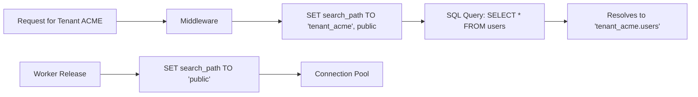

# 🏗️ PostgreSQL Schema-Based Isolation

**For enterprise-grade SaaS applications requiring absolute data privacy and high-performance querying, Eden provides built-in support for PostgreSQL schema-based isolation.**

---

## 🧠 Conceptual Overview

While row-level isolation (RLS) is standard, **Schema-Level Isolation** creates a physical separation of data using PostgreSQL namespaces (schemas). This ensures that each tenant's tables are physically isolated, offering superior security and simplifying database maintenance for large-scale fleets.

### The `search_path` Mechanism

Eden leverages the PostgreSQL `search_path` to dynamically route database queries to the correct tenant's schema at the start of every request.



### Core Philosophy
1.  **Physical Privacy**: Tenant A's data is in a different schema than Tenant B's data—preventing accidental `JOIN` leaks.
2.  **Zero-Change Codebase**: Your application code (e.g., `User.all()`) remains identical to row-level isolation.
3.  **Fleet Management**: Seamlessly apply migrations across 1, 10, or 1,000 schemas with a single command.

---

## 🚀 Enabling Schema Isolation

### 1. Configuration
Update your `.env` or app settings to switch strategies.

```bash
# .env
TENANCY_STRATEGY=schema
TENANCY_DEFAULT_SCHEMA=public
```

### 2. Tenant Model Integration
Ensure your `Tenant` model has a `schema_name` field. This name is used to identify the target schema in Postgres.

```python
tenant = await Tenant.create(
    name="Acme Corp", 
    slug="acme", 
    schema_name="tenant_acme"
)
```

---

## ⚡ Elite Patterns

### 1. Automated Provisioning (`provision_schema`)
When a new customer signs up, Eden can automatically create their schema, provision all necessary tables, and stamp it with the latest migration version.

```python
from eden.tenancy import Tenant

async def onboard_new_customer(name: str, slug: str):
    async with get_db() as session:
        # 1. Create the tenant record
        tenant = Tenant(name=name, slug=slug, schema_name=f"t_{slug}")
        session.add(tenant)
        await session.commit()

        # 2. Provision the database schema (Industrial Automation)
        # This creates the PG schema and runs all framework migrations
        await tenant.provision_schema(session)
```

### 2. Multi-Schema Migrations
Managing a fleet of schemas requires specialized tools. Eden’s CLI includes a `--all-tenants` flag to loop through every registered schema.

```bash
# Upgrade every tenant schema to the latest migration head
eden migrate upgrade --all-tenants

# Check migration status across the entire fleet
eden migrate status --all-tenants
```

---

## 🛡️ Critical Security & Performance

### 1. Connection Pool Safety
Eden implements a "Critical Reset" pattern. At the end of every request, the `search_path` is explicitly reset to `public`. This prevents **Connection Pollution**, where a subsequent request might inherit the previous tenant's schema.

### 2. Global vs. Scoped Tables
*   **Scoped**: Models with `TenantMixin` are created in each tenant's schema.
*   **Global**: Models **without** `TenantMixin` (e.g., system settings, global roles) remain in the `public` schema.

> [!TIP]
> **Performance Note**: For high-traffic applications, PostgreSQL handles hundreds of schemas extremely well. However, if you plan to exceed 2,000+ schemas, consider using the **Row-Level (RLS)** strategy or sharding across multiple database instances.

---

## 📄 API Reference

### `Tenant` Model Methods

| Method | Parameters | Description |
| :--- | :--- | :--- |
| `provision_schema`| `session: AsyncSession`| Low-level automation to create the schema and build all tables. |
| `get_schema_name` | - | Returns the sanitized schema string for the current tenant. |

### CLI Commands

| Command | Argument | Description |
| :--- | :--- | :--- |
| `eden migrate upgrade`| `--all-tenants` | Iterates through `eden_tenants` and migrates each. |
| `eden db setup` | `--schema X` | Initializes a specific schema for a new tenant manually. |

---

## 💡 Best Practices

1.  **Sanitization**: Always sanitize the `schema_name` (alphanumeric only) before creation to prevent SQL injection at the schema layer.
2.  **Monitoring**: Use PostgreSQL extensions like `pg_stat_statements` to monitor query performance specifically within tenant schemas.
3.  **Backup Strategy**: With schema-based isolation, you can perform granular backups/restores for a single tenant if needed.

---

**Next Steps**: [SaaS Admin Panel & Dashboard](admin.md)
