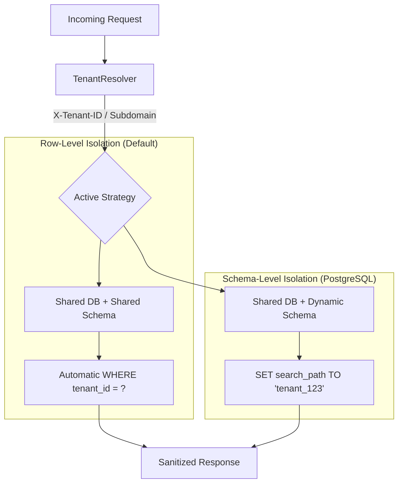

# 🏢 Multi-Tenancy & SaaS Architecture

**Eden is an industrial-grade, multi-tenant framework. It provides transparent data isolation, cross-tenant security guards, and flexible resolution strategies designed for the next generation of SaaS platforms.**

---

## 🧠 Conceptual Overview

Multi-tenancy in Eden is "Invisible by Design." Once a model is marked for isolation, the framework automatically scopes all database queries, cache entries, and background tasks to the active tenant—without requiring manual `WHERE` clauses from the developer.

### Isolation Strategies

Eden supports two primary isolation patterns depending on your security and scale requirements:



### Core Philosophy
1.  **Fail-Secure by Default**: If a tenant context cannot be resolved (and is required), Eden returns **zero results** instead of leaking global data.
2.  **Zero-Boilerplate Scoping**: Logic remains the same whether you're building a single-user app or a 10,000-tenant SaaS.
3.  **Context-Aware Workers**: Background tasks automatically inherit the tenant context of the trigger request.

---

## 🏗️ Model Architecture: The `TenantMixin`

To isolate a data model, inherit from `TenantMixin`. 

> [!IMPORTANT]
> **The Golden Rule**: Due to Python's Method Resolution Order (MRO), `TenantMixin` **must** appear before `Model` in your class definition.

```python
from eden.db import Model, f, Mapped
from eden.tenancy import TenantMixin

class Project(TenantMixin, Model):
    """
    Every record will have an automatic 'tenant_id' column.
    All queries (Project.all(), Project.get(id)) are automatically scoped.
    """
    title: Mapped[str] = f(label="Project Title")
    is_active: Mapped[bool] = f(default=True)
```

### Global (Shared) Data
For models that should be shared across all tenants (e.g., `SystemNotification`, `GlobalRole`), simply omit the `TenantMixin`.

---

## 🚀 Resolving the Active Tenant

Eden can resolve the current tenant using built-in strategies or custom logic.

| Resolver | Configuration | Typical Use Case |
| :--- | :--- | :--- |
| **`SubdomainResolver`**| `tenancy_resolver="subdomain"` | Professional SaaS (e.g. `acme.app.com`). |
| **`HeaderResolver`** | `tenancy_resolver="header"` | Mobile Apps, Internal APIs (e.g. `X-Tenant-ID`). |
| **`CookieResolver`** | `tenancy_resolver="cookie"` | Simple enterprise portals. |

### Custom Resolver Example
```python
from eden.tenancy import TenantResolver

class MyCustomResolver(TenantResolver):
    async def resolve(self, request):
        # Resolve via auth token metadata or specialized header
        return request.user.organization_id if request.user else None

app = Eden(tenancy_resolver=MyCustomResolver())
```

---

## ⚡ Elite Patterns

### 1. Safe Cross-Tenant Access (`AcrossTenants`)
System administrators often need to perform global reporting or maintenance. Use the `AcrossTenants` context manager to temporarily disable isolation.

```python
from eden.tenancy import AcrossTenants

@app.get("/admin/stats")
@require_role("super_admin")
async def global_report(request):
    async with AcrossTenants():
        # Scoping is disabled within this block
        total_revenue = await Invoice.sum("amount")
        tenant_count = await Tenant.count()
        
    return {"total": total_revenue, "tenants": tenant_count}
```

### 2. Manual Context Handling
In background jobs or CLI scripts, you can manually set the context.

```python
from eden.tenancy import set_tenant_context

async def my_background_worker(tenant_id: int):
    async with set_tenant_context(tenant_id):
        # Any DB queries here are scoped to the specified tenant
        project = await Project.first()
        await project.process_data()
```

### 3. Tenant-Aware Caching
Eden's `TenantCacheWrapper` ensures that cached data remains isolated even if two tenants use the same key name.

```python
# Tenant A sets 'settings' -> stored as 'tenant:123:settings'
# Tenant B sets 'settings' -> stored as 'tenant:456:settings'
await app.cache.set("settings", current_config)
```

---

## 📄 API Reference

### Context Helpers (`eden.tenancy`)

| Function | Parameters | Description |
| :--- | :--- | :--- |
| `get_current_tenant_id`| - | Returns the ID of the active tenant or `None`. |
| `set_tenant_context` | `tenant_id` | Context manager to bind a tenant to the current async task. |
| `AcrossTenants` | - | Context manager to bypass all multi-tenant isolation. |

### Configuration (`Eden` Settings)

| Setting | Default | Description |
| :--- | :--- | :--- |
| `TENANCY_ENABLED` | `True` | Master toggle for the multi-tenancy system. |
| `TENANCY_STRATEGY` | `"row"` | Choice between `"row"` (RLS) and `"schema"` (Postgres). |
| `TENANCY_HEADER` | `"X-Tenant-ID"` | Header name used by the `HeaderResolver`. |

---

## 💡 Best Practices

1.  **Test for Leakage**: Always write a test using `TenantClient` that verifies Tenant A cannot access Tenant B's data via ID.
2.  **Audit Logs**: Ensure that any use of `AcrossTenants()` is logged to an audit trail for compliance.
3.  **Avoid Raw SQL**: Row-level isolation is applied at the ORM level. If you use raw `await db.execute("SELECT...")`, you **must** manually append `WHERE tenant_id = :tid`.
4.  **Static Data**: Keep your system configuration and global roles in non-isolated models to simplify updates.

---

**Next Steps**: [PostgreSQL Schema-Level Isolation](tenancy-postgres.md)
