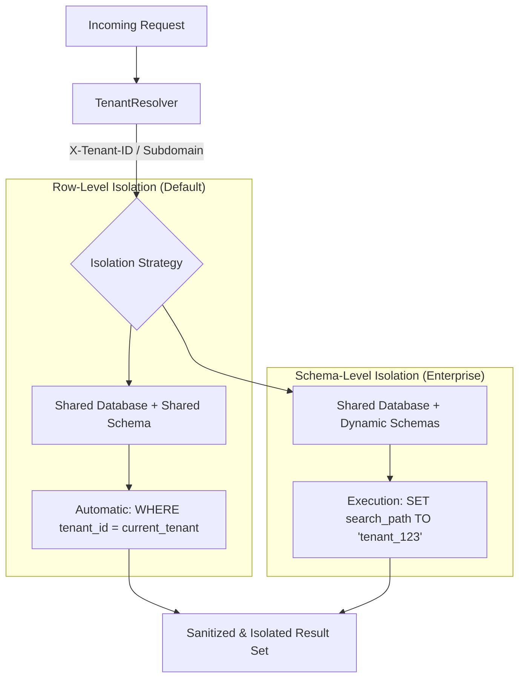

# 🏢 Multi-Tenancy & SaaS Architecture

**Eden is an industrial-grade, multi-tenant framework. It provides transparent data isolation, cross-tenant security guards, and flexible resolution strategies designed for the next generation of SaaS platforms.**

---

## 🧠 The Eden Multi-Tenant Pipeline

Multi-tenancy in Eden is "Invisible by Design." Once a model is marked for isolation, the framework automatically scopes all database queries, cache entries, and background tasks to the active tenant—without requiring manual `WHERE` clauses.



---

## ⚡ 60-Second Multi-Tenancy

To isolate a data model, simply inherit from `TenantMixin`.

```python
from eden.db import Model, f, Mapped
from eden.tenancy import TenantMixin

class CustomerInquiry(TenantMixin, Model):
    __tablename__ = "inquiries"
    
    subject: Mapped[str] = f()
    message: Mapped[str] = f()

# IN YOUR VIEW:
# Tenant A sees [Inquiry 1, Inquiry 2]
# Tenant B sees [Inquiry 3]
# No manual .filter(tenant_id=...) required!
all_inquiries = await CustomerInquiry.all() 
```

> [!IMPORTANT]
> **Method Resolution Order (MRO)**: Due to Python's inheritance rules, `TenantMixin` **must** appear before `Model` in your class definition.

---

## 🏗️ Managing the Active Tenant

Eden can resolve the current tenant using built-in strategies or custom logic (e.g., from a JWT claim).

| Resolver | Trigger | Typical Use Case |
| :--- | :--- | :--- |
| **`SubdomainResolver`**| `acme.app.com` | Standard B2B SaaS. |
| **`HeaderResolver`** | `X-Tenant-ID` | Mobile Apps / Internal APIs. |
| **`UserResolver`** | `request.user` | Enterprise internal tools. |

### Manual Context Overrides
In background jobs or CLI scripts, you can manually set the context for a specific task.

```python
from eden.tenancy import set_tenant_context

async def nightly_cleanup(tenant_id: str):
    # Any DB queries here are now scoped to 'tenant_id'
    async with set_tenant_context(tenant_id):
        await Project.filter(is_stale=True).delete()
```

---

## ⚡ Elite Patterns

### 1. Cross-Tenant Reporting (`AcrossTenants`)
System administrators often need to perform global reporting. Use the `AcrossTenants` context manager to temporarily disable isolation and access the entire database.

```python
from eden.tenancy import AcrossTenants

@app.get("/admin/global-stats")
@require_role("super_admin")
async def global_stats(request):
    async with AcrossTenants():
        # Scoping is disabled within this block
        total_revenue = await Invoice.sum("amount")
        tenant_count = await Tenant.count()
        
    return {"total_revenue": total_revenue, "active_tenants": tenant_count}
```

### 2. Tenant Provisioning Lifecycle
Automate the creation of a new client workspace—including database migrations, storage buckets, and trial plans.

```python
async def onboard_new_client(name: str):
    # 1. Create the base Tenant record
    tenant = await Tenant.create(name=name)
    
    # 2. If using Schema-Level isolation, trigger schema creation
    await tenant.bootstrap_schema()
    
    # 3. Provision default data (e.g. 'General' folder)
    async with set_tenant_context(tenant.id):
        await Folder.create(name="General")
```

---

## 📄 API Reference

### `eden.tenancy` Context Helpers

| Function | Returns | Description |
| :--- | :--- | :--- |
| `get_current_tenant_id`| `UUID \| None`| Returns the ID of the active tenant. |
| `set_tenant_context(id)`| `ContextMgr` | Binds a tenant ID to the current async task. |
| `AcrossTenants()` | `ContextMgr` | Bypasses all multi-tenant isolation rules. |

---

## 💡 Best Practices

1. **Test for Leakage**: Always use `TenantClient` in your tests to verify that Tenant A cannot access Tenant B's data via their primary key or ID.
2. **Audit Compliance**: Always log uses of `AcrossTenants()` to your audit trail to ensure system administrators are acting in accordance with security policies.
3. **Global Models**: For models that should be shared across all clients (e.g. `SystemState`, `ProductTiers`), simply omit the `TenantMixin`.

---

**Next Steps**: [PostgreSQL Schema-Level Isolation](tenancy-postgres.md) | [Background Tasks](background-tasks.md)
