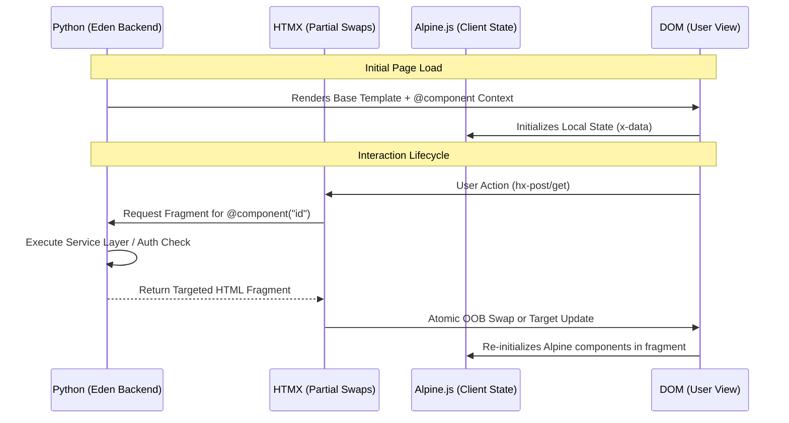

# 🌿 Eden UI Master Class: High-Fidelity Orchestration

Eden provides a production-ready, **Elite-First** UI library. Unlike generic component kits, Eden is built on a "Unified Architecture" where **Python logic**, **HTMX fragments**, and **Alpine.js micro-interactions** function as a single, cohesive organism.

---

## 💎 The Design Philosophy: "Elite SaaS"

Every component in Eden is engineered to feel like a $100M custom-built platform:

- **Glassmorphic Depth**: Heavy use of `backdrop-blur-2xl`, `bg-white/5`, and `border-white/10` for a premium layer effect.
- **Organic Motion**: Spring-based animations and "ambient pulse" indicators that provide subconscious feedback.
- **Zero-Orphan Logic**: No UI element exists without a corresponding backend integrity check or transaction handler.

---

## 🏛️ The Unified Architecture Trinity

Before building, understand how the three layers of Eden's UI engine communicate:



### Key Integration Rules

1. **Source of Truth**: The Backend (Python) owns the **Data**.
2. **Micro-Manager**: Alpine.js owns the **Instant Feel** (toggles, transitions).
3. **The Courier**: HTMX owns the **Synchronization** (data persistence without full refreshes).

---

## 🛠️ The Core Directive: `@component`

You invoke components in your templates using the `@component` directive. This is cleaner than standard Jinja2 `include` or `macro` tags and allows for scoped block inheritance.

```html
@component("alert", type="success", dismissible=true) {
    Your profile has been updated successfully!
}
```

### Slots & Props

Most components support **Named Slots** for maximum flexibility:

```html
@component("modal", title="Create Project") {
    <!-- Default Slot (Body) -->
    <p>Ready to start something new?</p>

    @slot("footer") {
        <button class="eden-btn-secondary">Cancel</button>
        <button class="eden-btn-primary">Create</button>
    }
}
```

---

## 💎 The Elite Component Suite

These components represent the "High-Water Mark" of Eden UI. Built for complex, multi-tenant enterprise applications.

### 1. `<x-live-sync />` (Ambient Status)

Provides a visual, ambient "pulse" for background activity and sync status. Perfect for real-time dashboards where users need reassurance of data freshness.

**Usage:**

```html
<!-- Ambient sync with label and activity monitoring -->
@component("live-sync", active=true, label="System Sync")
```

**Full-Stack Workflow:**

```python
# In your backend view or middleware:
# When a background sync starts, the live-sync will listen for the 'eden:sync' event.
from eden.signals import Signal
api_sync = Signal("eden:sync")
api_sync.send(sender=None, state="syncing")
```

---

### 2. `<x-tenant-selector />` (Multi-Tenancy)

A searchable, glassmorphic dropdown for switching between tenants/organizations. It automatically handles the `Initial Generation` for logos.

**Properties:**

- `tenants`: A list of objects with `id`, `name`, and optionally `avatar`.
- `current`: The ID or Name of the active tenant.

**Usage:**

```html
@component("tenant-selector", 
    current="Cyberdyne Systems", 
    tenants=[
        {"id": 1, "name": "Cyberdyne Systems"},
        {"id": 2, "name": "Stark Industries"},
        {"id": 3, "name": "Wayne Enterprises"}
    ])
```

**Backend Connection:**

The selector should trigger a backend change via HTMX:

```html
<div hx-post="/tenants/switch" hx-trigger="click from:#tenant-item-{id}">
    <!-- Selector Component Interior -->
</div>
```

---

### 3. `<x-atomic-dropzone />` (Resilient Storage)

A visual file upload area that bridges the gap between the UI and Eden's `AtomicStorageTransaction`. It handles real-time progress tracking via XHR.

**Properties:**

- `id`: Unique identifier for the upload context.
- `multiple`: Boolean (default: `true`).
- `accept`: File types (e.g., `image/*, .pdf`).

**Usage:**

```html
@component("atomic-dropzone", id="asset-upload", accept=".pdf")
```

---

### 4. `<x-command-bar />` (AI & Global Navigation)

A CMD+K global overlay for semantic search and navigation. It integrates with Eden's AI-Powered Vector Search to provide instant, meaningful results.

**Usage:**

```html
<!-- Rendered once at the end of the layout -->
@component("command-bar", placeholder="Ask Eden or search commands...")
```

**AI Integration Pattern:**

```html
<input hx-get="/search/semantic" 
       hx-trigger="keyup changed delay:200ms" 
       hx-target="#command-results-list"
       placeholder="Find project settings...">
```

---

## 📚 Standard Component Catalog

While the Elite Suite handles complex states, the Standard Catalog provides the building blocks for every page.

### 1. Modals & Overlays (Stateful Dialogs)

Eden modals are more than just popups; they are **Context Containers** that support Alpine.js transitions and HTMX fragment loading.

**Full-Stack Validation Pattern:**

This pattern shows how to handle a "Create User" form inside a modal with real-time backend validation.

```html
@component("modal", id="user-modal", title="Add Team Member") {
    @slot("trigger") {
        <button class="eden-btn-primary">Add Member</button>
    }
    
    <form hx-post="/api/users" 
          hx-target="#user-modal-body" 
          hx-swap="innerHTML"
          class="space-y-4">
        
        <div>
            <label class="eden-label">Email Address</label>
            <input type="email" name="email" class="eden-input" required>
            <!-- Error placeholder for HTMX swaps -->
            <div id="email-error" class="text-red-400 text-xs mt-1"></div>
        </div>

        @slot("footer") {
            <button type="submit" class="eden-btn-primary w-full">
                Create Account
            </button>
        }
    </form>
}
```

> [!TIP]
> Use `hx-target="#user-modal-body"` to swap only the interior of the modal if validation fails, keeping the modal open and the user in flow.

---

### 2. Tabs & Lazy Loading (Performance)

Tabs in Eden support **Lazy Loading**. Instead of rendering all tabs at once, use HTMX to fetch tab content only when it's clicked.

**Usage:**

```html
@component("tabs", active=0, tabs=[
    {"id": "details", "label": "Project Details"},
    {"id": "billing", "label": "Billing & Invoices", "hx_get": "/api/billing/summary"}
]) {
    @slot("tab_details") {
        <!-- Standard content -->
        <p>Core project metadata...</p>
    }
    <!-- tab_billing will be loaded via hx-get if defined -->
}
```

---

### 3. Stat Cards (Live Metrics)

Stat cards are perfect for financial dashboards (Payments) or system monitoring. Combine them with `@reactive` for real-time value updates.

**Payments Use Case:**

```html
<div class="grid grid-cols-1 md:grid-cols-3 gap-6">
    @component("stat", 
        label="Monthly Recurring Revenue (MRR)", 
        value="$48,200", 
        trend="+8.4%", 
        icon="payments", 
        progress=85,
        color="lime")
    
    @component("stat", 
        label="Pending Payouts", 
        value="$4,102", 
        trend="stable", 
        icon="account_balance", 
        progress=12,
        color="slate")
</div>
```

---

### 4. Data Tables (AI-Powered Search & Filter)

Tables integrate directly with Eden's `QuerySet` API.

```html
<div class="eden-card">
    <div class="p-4 border-b border-white/10 flex justify-between items-center">
        <h3 class="font-bold">Transaction History</h3>
        <!-- AI Filter Input -->
        <input type="text" 
               hx-get="/api/transactions/search" 
               hx-trigger="keyup changed delay:300ms"
               hx-target="#transaction-table"
               class="eden-input w-64" 
               placeholder="AI Search (e.g. 'high value last week')...">
    </div>

    @component("data-table", id="transaction-table", items=transactions, columns=[
        {"key": "date", "label": "Date"},
        {"key": "amount", "label": "Amount"},
        {"key": "status", "label": "Status", "template": "status_badge"}
    ])
</div>
```

---

## 📋 Forms & Validation Mastery

Eden bridges the gap between Python's strong typing and the web's loose inputs.

### The Secure Form Pattern

All Eden forms inside components are **Secure by Default**. By using `@component("form")`, CSRF protection and multi-tenant isolation are injected automatically.

```html
@component("form", action="/api/profile/update", method="POST") {
    <div class="space-y-6">
        @component("input", name="display_name", label="Public Name", value=user.name)
        
        @component("input", 
            name="bio", 
            type="textarea", 
            label="Short Bio", 
            placeholder="Tell your story...")

        <div class="flex justify-end gap-3">
            <button class="eden-btn-secondary">Discard Changes</button>
            <button type="submit" class="eden-btn-primary">Save Profile</button>
        </div>
    </div>
}
```

### Real-Time Validation Loop

1. **User Types**: `hx-trigger="keyup changed delay:500ms"` sends data to the server.
2. **Backend Check**: Python service validates the partial field.
3. **Fragment Return**: Eden returns a small `<x-error />` component if invalid.

```html
<!-- Inside a form -->
<input type="text" name="slug" 
       hx-post="/api/validate/slug" 
       hx-target="next .error-container">
<div class="error-container"></div>
```

---

## 🚀 Advanced Interactivity

### 🎨 Mastering Alpine.js in Eden

To avoid conflicts between the Eden Templating Engine and Alpine.js, follow these **Elite Rules**:

1. **Full Attributes**: Avoid `@click` or `:class`. Use `x-on:click` and `x-bind:class`.
2. **External Events**: Trigger Eden components from anywhere using custom events.

```html
<!-- Trigger the 'config-modal' from a separate button -->
<button x-on:click="$dispatch('eden:modal-open', { id: 'config-modal' })">
    Remote Toggle
</button>
```

### 🏛️ Smart Fragment Resolution (HTMX)

Eden components automatically support partial updates. When you make an HTMX request with a `HX-Target` matching a component ID, Eden only renders that specific fragment.

```html
<!-- Only the 'activity-list' fragment will be re-rendered and swapped -->
<button hx-get="/activity/refresh" 
        hx-target="#activity-list" 
        hx-trigger="click">
    Refresh Logs
</button>
```

---

## 💎 Utility Reference

### Button Classes

- `eden-btn-primary`: Vibrant Lime highlight.
- `eden-btn-secondary`: Subtle slate ghost button.
- `eden-btn-danger`: Alert/Exit actions.

### Input Classes

- `eden-input`: Standard text/password field with focus glow.
- `eden-select`: Styled dropdown.
- `eden-checkbox`: Premium custom checkbox.

---

## 🛠️ Customizing the CSS

Eden uses CSS Variables for easy white-labeling. Update these in your global stylesheet:

```css
:root {
  --eden-primary: theme('colors.lime.400');
  --eden-bg: #0F172A;
  --eden-accent: #38BDF8; /* Light blue accent */
}
```

> [!TIP]
> For advanced layout control, see the [Layout API Layouts Guide](../layouts/api.md).
