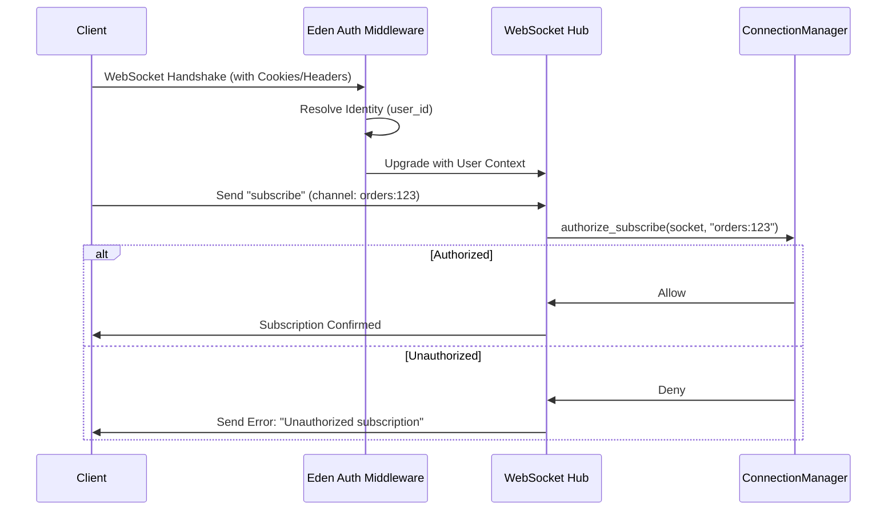

# WebSockets & Real-Time 🔌

Eden provides a high-level, event-driven WebSocket system that makes real-time communication as simple as standard HTTP routing. By combining the `WebSocketRouter` with Eden's **Reactive ORM**, you can build live-updating dashboards and chat systems with almost zero boilerplate.

## The Event-Driven Router: `WebSocketRouter`

For production applications, we recommend using the `WebSocketRouter`. It allows you to organize your real-time logic into specialized event handlers.

```python
from eden.websocket import WebSocketRouter

# Initialize router with a prefix
chat_ws = WebSocketRouter(prefix="/ws/chat")

@chat_ws.on_connect
async def on_connect(socket, manager):
    """Called when any client connects."""
    # manager is the room-aware ConnectionManager
    await manager.broadcast({"event": "sys", "msg": "A user joined"}, room="lobby")

@chat_ws.on("chat_message")
async def handle_chat(socket, data, manager):
    """
    Handle the 'chat_message' event.
    'data' is automatically parsed from the incoming JSON.
    """
    room = data.get("room", "lobby")
    await manager.broadcast({
        "event": "chat_message",
        "user": socket.user.name,
        "text": data["text"]
    }, room=room)

# Mount the router to your Eden app
chat_ws.mount(app)
```

The `WebSocketRouter` expects JSON messages with an `event` key. If no `event` key is found, it defaults to the `"message"` event.

```json
{
  "event": "chat_message",
  "text": "Hello Eden!",
  "room": "lobby"
}
```

## Room Management: `ConnectionManager`

The `manager` instance provided to your handlers is a powerful tool for targeting specific groups of users.

| Method | Description |
| :--- | :--- |
| `broadcast(message, room="default")` | Sends to everyone in the specified room. |
| `send_to(socket, message)` | Sends to a specific individual connection. |
| `count(room="default")` | Returns the number of active users in a room. |
| `rooms` | A property returning all active room names. |

## 🔄 Reactive ORM: Automating the UI

Eden's "Killer" real-time feature is its **Reactive Layer**. When a model is marked as reactive, Eden automatically broadcasts changes to a dedicated WebSocket channel.

### 1. Enable Reactivity

```python
class Task(Model):
    __reactive__ = True  # Automatically triggers broadcasts on save/delete
    title: str
    is_done: bool = False
```

### 2. Frontend Integration (HTMX + WebSockets)

Eden ships with a custom HTMX extension to handle these model broadcasts without you writing a single line of JS.

```html
<div hx-ext="ws" ws-connect="/ws/tasks/updates">
    <div id="task-list" 
         hx-get="/tasks/fragment" 
         hx-trigger="tasks:updated, tasks:created from:body">
        @include("partials/tasks")
    </div>
</div>
```

> [!NOTE]
> When `Task.save()` is called in the backend, Eden broadcasts a `tasks:updated` event. The HTMX extension captures this and triggers the `hx-get` to refresh the list surgically.

## Security & Persistence 🔐

### Authentication

Eden's `WebSocketRouter` automatically integrates with your `SessionMiddleware`. The `socket` object in your handlers has a `.user` attribute populated if the user is logged in.

```python
@ws.on_connect
async def secure_connect(socket, manager):
    if not socket.user.is_authenticated:
        await socket.close(code=1008)  # Policy Violation
        return
```

### Multi-Tenancy

```python
@ws.on("message")
async def handle_tenant_msg(socket, data, manager):
    # Isolated by tenant_id
    room = f"tenant_{socket.user.tenant_id}_chat"
    await manager.broadcast(data, room=room)
```

---

## 🔒 Security & Channel Authorization

In production, it is vital to ensure that users can only subscribe to channels they are authorized to see. Eden provides a specialized hook in the `ConnectionManager` for this purpose.

### The Connection Handshake



### Implementing `authorize_subscribe`

By default, Eden allows all subscriptions for authenticated users. You can override this behavior in your `ConnectionManager` (reachable via `app.manager`) to implement strict isolation.

```python
# Typically configured in your app entry point
class SecureConnectionManager(ConnectionManager):
    async def authorize_subscribe(self, socket, channel: str) -> bool:
        """
        Custom logic to permit or deny a subscription.
        Automatically called by Eden on every "subscribe" event.
        """
        # Example: Isolation by User ID
        if channel.startswith("user:"):
             authorized_user_id = channel.split(":")[1]
             return str(socket.user.id) == authorized_user_id
             
        # Example: Isolation by Product ID
        if channel.startswith("product:"):
             product_id = channel.split(":")[1]
             return await check_product_permission(socket.user, product_id)

        return True

# Initialize app with custom manager
app = Eden(__name__, manager=SecureConnectionManager())
```

> [!IMPORTANT]
> **User Context**: Every `socket` object in Eden now carries a `user_id` and `user` object extracted during the initial handshake. This context is immutable and verified against your main session/auth store.

---

## 🚀 Tutorial: Building a Professional Chat App

This tutorial demonstrates a feature-complete chat system with **room isolation**, **authenticated users**, and **presence tracking**.

### 1. The Backend (`app/realtime.py`)

```python
from eden.websocket import WebSocketRouter

chat_ws = WebSocketRouter(prefix="/ws/chat")

@chat_ws.on_connect
async def auth_and_join(socket, manager):
    # 1. Enforce authentication
    if not socket.user.is_authenticated:
        return await socket.close(code=1008)
    
    # 2. Extract room from query string (e.g., ?room=marketing)
    room = socket.query_params.get("room", "lobby")
    
    # 3. Join room and notify others
    await manager.join(socket, room=room)
    await manager.broadcast({
        "event": "presence",
        "user": socket.user.name,
        "action": "joined",
        "count": manager.count(room)
    }, room=room)

@chat_ws.on("new_message")
async def handle_message(socket, data, manager):
    # Broadcast to the specific room only
    room = socket.query_params.get("room", "lobby")
    
    await manager.broadcast({
        "event": "chat",
        "user": socket.user.name,
        "text": data["text"],
        "timestamp": datetime.now().isoformat()
    }, room=room)
```

### 2. The Frontend (`chat.html`)
Using standard WebSockets with HTMX for surgical message insertion.

```html
<div class="chat-container h-96 flex flex-col border rounded-xl shadow-lg">
    <div id="chat-messages" 
         class="flex-1 overflow-y-auto p-4 space-y-4 bg-gray-50"
         hx-ext="ws" 
         ws-connect="/ws/chat?room={{ current_room }}">
        
        <!-- Welcome Message -->
        <div class="text-center text-xs text-gray-400">
            Welcome to the #{{ current_room }} room
        </div>
    </div>

    <!-- Message Input -->
    <form ws-send class="p-4 border-t bg-white flex gap-2">
        <input name="text" 
               placeholder="Type a message..." 
               class="flex-1 px-4 py-2 border rounded-full focus:ring-2"
               autocomplete="off">
        <button type="submit" class="p-2 bg-blue-600 text-white rounded-full">
            <svg ...></svg>
        </button>
    </form>
</div>

<!-- Fragment for surgical message insertion -->
@fragment("message-bubble") {
    <div class="flex flex-col {{ 'items-end' if is_me else 'items-start' }}">
        <span class="text-[10px] text-gray-400 mb-1">{{ user }}</span>
        <div class="px-4 py-2 rounded-2xl max-w-[80%] {{ 'bg-blue-600 text-white' if is_me else 'bg-white border' }}">
            {{ text }}
        </div>
    </div>
}
```

---

## 🛠️ Advanced: Heartbeats & Reconnection

For high-availability real-time systems, always implement heartbeats to detect "zombie" connections.

```python
@chat_ws.on("heartbeat")
async def handle_ping(socket, data, manager):
    # Simply echo back to keep the connection alive
    await manager.send_to(socket, {"event": "heartbeat_ack"})
```

**Client-side best practice:**
The `ws` extension in HTMX automatically handles reconnection with exponential backoff if the server goes down, ensuring a premium "it just works" experience for your users.

---

**Next Steps**: [Background Tasks & Scheduling](background-tasks.md)
