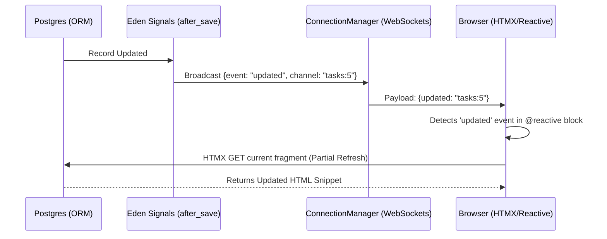

# 📜 Recipe: Real-time Reactive UI with WebSockets & ORM

> [!TIP]
> **Task**: Automatically update specific UI components across all connected clients whenever a database record changes.
> **Level**: Intermediate
> **Synergy**: `EdenORM` + `ConnectionManager` + `@reactive` Template Directive.

---

## 🗺️ Architectural Flow

The Eden "Reactive Loop" bypasses the need for manual frontend state management by using server-side triggers:



---

## 🍽️ The Ingredients

- **`__reactive__ = True`**: A flag on your Model to enable automated broadcasting.
- **`ConnectionManager`**: The engine in `eden.websocket` that holds active connections.
- **`@reactive(obj)`**: The template directive that creates a "Live Zone" in your HTML.

---

## 👨‍🍳 Preparation (One-Stop-Shop snippet)

To enable this, your feature is split across three layers: the Model, the Route, and the Template.

```python
# 1. Model Layer (app/models.py)
from eden.db import Model, fields

class Project(Model):
    __tablename__ = "projects"
    __reactive__ = True  # <--- MAGIC LINE: Enables Signal -> WebSocket bridge
    
    id = fields.IntField(primary_key=True)
    status = fields.StringField(default="pending")

# 2. Router Layer (app/routes.py)
from eden import Router, render_template

router = Router()

@router.get("/projects/{id}")
async def project_detail(request, id: int):
    project = await Project.get(id)
    return render_template("project.html", project=project)

# 3. Background Task / Logic (app/services.py)
async def mark_project_complete(id: int):
    project = await Project.get(id)
    project.status = "completed"
    await project.save() # This automatically triggers the UI update!
```

---

## 🧭 The Process (Step-by-Step)

### 1. The "Live Zone" Template

In your HTML, wrap the section you want to refresh in a `@reactive` block.

**File**: `templates/project.html`
```html
@extends("layouts/base")

@section("content") {
    <h1>Project Status</h1>

    @reactive(project) {
        <div class="p-6 rounded-xl {{ 'bg-green-500' if project.status == 'completed' else 'bg-amber-500' }}">
            Status: @span(project.status)
        </div>
    }
}
```

### 2. Understanding the Connection

When `project.save()` is called:
1. Eden's `after_update` listener (in `eden.db.listeners`) detects the `__reactive__ = True` flag.
2. It calculates the channel name: `projects:5`.
3. It broadcasts a signal to all WebSockets subscribed to `projects:5`.
4. The `@reactive` directive generates a `<div>` with `hx-sync="projects:5"` which listens for this signal.

### 3. "No-Assumptions" Setup

Ensure your `app.py` has the WebSocket manager initialized:

```python
from eden import Eden
from eden.websocket import connection_manager

app = Eden()
# No extra config needed usually, but can be customized:
# connection_manager.require_csrf = True
```

---

## 📋 Common Usage Patterns

### A. Individual Resource Sync
Automatically refreshes when a specific record (e.g., Task #5) is updated in the database.

```html
<!-- Automatically refreshes when Task #5 is updated in the DB -->
@reactive(task) {
    <div class="card p-4 glass">
        <h3 class="text-xl font-bold">{{ task.title }}</h3>
        <p>{{ task.description }}</p>
        
        <!-- Standard HTMX actions now trigger reactive UI updates -->
        <button hx-post="/tasks/{{ task.id }}/toggle" class="btn btn-primary">
            Toggle Status
        </button>
    </div>
}
```

### B. Global Collection Sync
Automatically refreshes when **any** record in the table is created, updated, or deleted. This is ideal for list views.

```html
<!-- Automatically refreshes when ANY task is created or deleted -->
@reactive(Task) {
    <div class="task-list">
        @for(t in Task.all()) {
            <div>@span(t.title)</div>
        }
    </div>
}
```

---

## 🏁 Result & Verification

1. Open your project page in two browser tabs.
2. Update the `status` in the database (via CLI or another route).
3. Observe the change reflecting **immediately** in the second tab without a page refresh!

---

## 🛡️ Edge Cases & Variations

### 1. Synchronizing Lists (Custom Channels)
By default, Eden syncs on the specific record ID (`projects:5`). If you want a list view to refresh whenever *any* project is updated, override `get_sync_channels()` on your model.

```python
from eden.db import Model, fields

class Project(Model):
    __tablename__ = "projects"
    __reactive__ = True
    
    id = fields.IntField(primary_key=True)
    title = fields.StringField(max_length=100)

    def get_sync_channels(self) -> list[str]:
        # Now every update to this record also notifies the base "projects" channel
        return ["projects"]
```

In your list template:
```html
@reactive("projects") {
    @for (project in projects) {
        <li>@span(project.title)</li>
    }
}
```

### 2. Manual Broadcast (No DB Save)

Sometimes you need to trigger a UI refresh based on internal state changes or external API events, even if the database hasn't changed.

```python
from eden.realtime import realtime_manager

async def trigger_ui_refresh():
    # Force all "projects:5" reactive blocks to refresh
    await realtime_manager.broadcast(
        {"event": "updated", "channel": "projects:5"}, 
        channel="projects:5"
    )
```

> [!IMPORTANT]
> When broadcasting manually, ensure the payload contains `{"event": "updated", "channel": "..."}` as the `@reactive` directive generates HTMX listeners specifically for these keys.

---

## 🧠 Why Use This Pattern?
This is the **Eden Way** because it keeps business logic exclusively on the server. There is **zero JavaScript** required to handle the state sync; the framework manages the orchestration between the ORM and the UI fragments.
