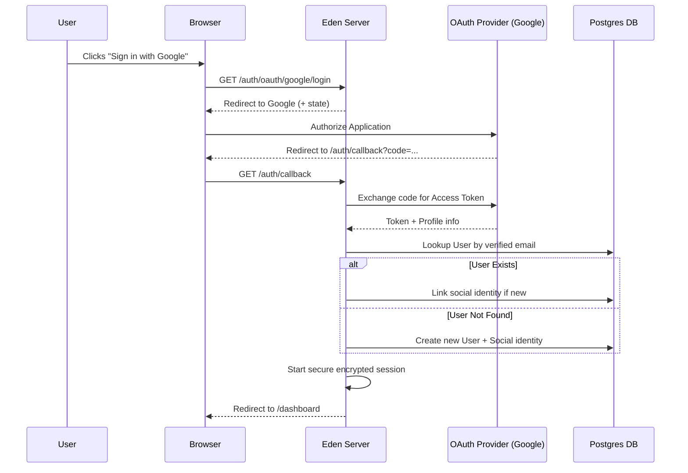

# 🌐 OAuth Social Auth: The "Frictionless" Pattern

**Learn how to implement a complete, production-ready Social Login flow in Eden—featuring automated account linking, custom profile synchronization, and a premium UI integration.**

---

## 🧠 The Architecture

A professional OAuth flow isn't just about redirects; it's about **identity reconciliation**. Eden handles the "handshake" automatically, but the "Elite" pattern involves synchronizing extra data (like avatars and bios) while ensuring zero duplicate accounts.



---

## 🚀 The Implementation


### 1. Configuration (`.env`)
Register your application in the [Google Cloud Console](https://console.cloud.google.com/) and add your credentials.

```bash
GOOGLE_CLIENT_ID="your_google_id.apps.googleusercontent.com"
GOOGLE_CLIENT_SECRET="your_google_secret"
```


### 2. The Elite Onboarding Handler
Instead of just logging the user in, we'll use the `on_login` callback to synchronize their profile picture and bio from Google.

```python
from typing import Dict, Any
from eden.auth.oauth import OAuthManager
from eden.db import Model, f, Mapped

# Dummy for validation
class RedirectResponse:
    def __init__(self, url: str): self.url = url

# 1. Define our User model with extra profile fields
class User(Model):
    __tablename__ = "users_recipe"
    email: Mapped[str] = f(unique=True, index=True)
    full_name: Mapped[str] = f(nullable=True)
    avatar_url: Mapped[str] = f(nullable=True)
    bio: Mapped[str] = f(nullable=True)

# 2. Custom handler to sync profile data
async def sync_google_profile(request, profile: Dict[str, Any]):
    """
    Called by Eden AFTER successful authentication but BEFORE the final redirect.
    'profile' contains verified data from the OAuth provider.
    """
    email = profile.get("email")
    
    # Fetch or update the user (Eden's OAuth handles the core linking, 
    # we just handle the extra fields)
    user = await User.filter(email=email).first()
    if user:
        await user.update(
            full_name=profile.get("name"),
            avatar_url=profile.get("picture"),
            bio=f"Joined via Google | {profile.get('locale', 'en')}"
        )
    
    # Return None to use default Eden redirect, or a RedirectResponse for custom flow
    return None

# 3. Register the provider
oauth = OAuthManager()
oauth.register_google(
    client_id="MOCK_ID", 
    client_secret="MOCK_SECRET", 
    on_login=sync_google_profile
)
```

---

## 🛡️ Edge Cases & Variations

- **Manual Account Linking**: If a user is already logged in, visiting `/auth/oauth/google/login` will link Google to their **active** session instead of creating a new one.
- **Verification Guard**: Eden automatically rejects OAuth profiles where `email_verified` is `False`, protecting you from impersonation attacks.
- **CSRF Protection**: Every redirect includes a unique `state` token stored in an encrypted cookie, preventing intercept-and-replay attacks.

---

## 💡 Best Practices

1. **Miniminze Scopes**: Only request `openid`, `email`, and `profile`. Requesting `contacts` or `drive` access will significantly lower your conversion rate.
2. **Branded Buttons**: Use the official Google/GitHub brand colors and logos. Users trust familiar "Sign in with..." buttons more than custom-styled ones.
3. **Graceful Failures**: If the OAuth provider is down, Eden's `OAuthManager` will raise a `ProviderUnavailable` exception. Catch this in your custom handler to show a friendly error message.

---

**Next Steps**: [Multi-Tenant Schema Isolation](tenant-isolation.md) | [Real-time UI Updates](realtime-updates.md)
