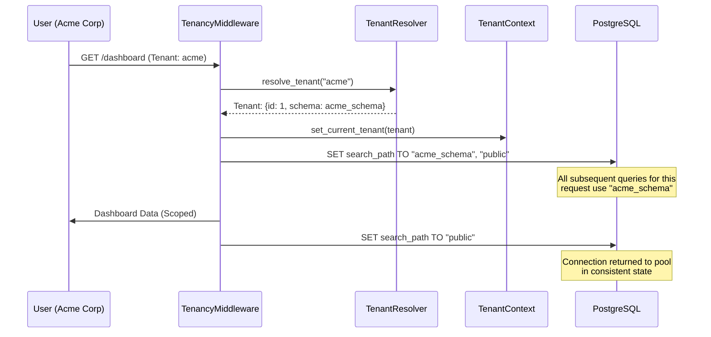

# 🏢 Multi-Tenant Schema Isolation: The "Enterprise" Pattern

**Absolute data privacy and physical separation for your high-value customers. Learn how to configure PostgreSQL schema-based isolation and automate tenant onboarding in Eden.**

---

## 🧠 The Architecture

While row-level isolation (RLS) is easier to start, **Schema-Level Isolation** is the choice for enterprise-grade SaaS. It creates a physical database "Namespace" for each tenant, ensuring Tenant A's data can *never* leak into Tenant B's queries—even if you accidentally leave a `join()` unscoped.

### The Request Lifecycle

The flow below traces how an incoming request is automatically "caged" into a specific schema:



---

## 🚀 The Implementation

### 1. Enable Schema Strategy (`.env`)

To enable Enterprise mode, switch Eden from the default `row` strategy to `schema`.

```bash
# .env
TENANCY_STRATEGY="schema"
TENANCY_DEFAULT_SCHEMA="public"
```

> [!TIP]
> **Why separate the schemas?** Physical separation allows for granular backups, custom extensions per tenant (e.g., dedicated indexes for power users), and zero-leakage security.

### 2. Defining Models correctly

In a multi-tenant application, you have two types of data: **Shared** (Public) and **Isolated** (Tenant).

```python
from eden.db import Model, f
from eden.tenancy import TenantMixin

# 1. SHARED MODEL (Exists only in 'public' schema)
class Organization(Model):
    __tablename__ = "organizations"
    name: str = f(max_length=255)
    slug: str = f(unique=True)
    schema_name: str | None = f(nullable=True)

# 2. ISOLATED MODEL (Exists in EVERY tenant schema)
# Inheriting from TenantMixin marks this model for schema-level isolation.
class Project(Model, TenantMixin):
    __tablename__ = "projects_scoped"
    name: str = f(max_length=100)
```

> [!IMPORTANT]
> **Automatic Markings**: Any model inheriting from `TenantMixin` is automatically flagged as `__eden_tenant_isolated__ = True`. This information is used by the migration engine to determine where tables should be created.

---

## 🛠️ Onboarding & Provisioning

When a new enterprise customer signs up, we'll create their `Tenant` record and then **physically provision** their namespace.

```python
from eden.tenancy import Tenant

async def onboard_customer(name: str, site_slug: str):
    """
    1. Register the Tenant in the 'public' table.
    2. Provision the Postgres schema and create isolated tables.
    """
    # Sanitize schema name: alphanumeric + underscore only
    schema_name = f"t_{site_slug.replace('-', '_')}"
    
    # 1. Create the tenant record in the central registry
    tenant = await Tenant.create(
        name=name, 
        slug=site_slug, 
        schema_name=schema_name
    )
    
    # 2. Industrial Automation: Provision the physical schema
    # This runs 'Model.metadata.create_all' within the new schema
    # and stamps it with the current migration revision.
    db = Tenant._get_db()
    async with db.transaction() as session:
        await tenant.provision_schema(session)
    
    print(f"✅ Enterprise Tenant {name} is LIVE at schema {schema_name}")
    return tenant
```

---

## 📦 Migrations & Deployment

The Eden migration engine is "Isolation Aware." It knows when to run a migration on the **Public** schema and when to iterate through **All Tenants**.

### Managing Tenant Migrations

When you modify an isolated model (like `Project` above), you must run migrations for all physical schemas.

```bash
# 1. Generate an isolation-aware migration
eden db migrate generate -m "add_priority_to_projects"

# 2. Run shared migrations for the framework (public schema)
eden db migrate upgrade

# 3. Run isolated migrations for ALL tenant schemas
eden db migrate upgrade --all-tenants
```

### Manual Migration Flags

If you write a manual migration, you must specify whether it is intended for tenant schemas:

```python
# migrations/versions/xxxx_custom_logic.py
revision = 'xxxx'
down_revision = 'yyyy'

# CRITICAL: Set to True for tenant schemas, False for 'public'
__eden_tenant_isolated__ = True

def upgrade():
    # Eden's engine will automatically SKIP this script 
    # if the current context (Public vs Tenant) doesn't match
    pass
```

---

## 🛡️ Industrial-Grade Safety

1. **Connection Pollution Guard**: Eden's middleware explicitly sends `SET search_path TO public` at the end of every request. This prevents data leakage across pooled connections.
2. **Schema Sanitization**: `Tenant.provision_schema()` rejects any `schema_name` that contains non-alphanumeric characters, preventing schema-layer SQL Injection.
3. **Fail-Secure Architecture**: If a tenant cannot be resolved, Eden defaults the `search_path` to an empty state, making all isolated tables **invisible** to the query.

### Cross-Tenant Summaries

Need to sum all revenue across every enterprise customer? Use the `AcrossTenants` bypass.

```python
from eden.tenancy import AcrossTenants, TenantMixin
from eden.db import Model, f

class Invoice(Model, TenantMixin):
    __tablename__ = "invoices_report"
    amount: float = f()

async def get_global_revenue():
    async with AcrossTenants():
        # This will iterate through all registered tenant schemas
        total = await Invoice.sum("amount")
    return total
```

---

## 💡 Troubleshooting

### `UndefinedTableError` in Migrations
If you encounter `UndefinedTableError` during a tenant migration, verify:
- You didn't forget the `--all-tenants` flag.
- The migration script has the correct `__eden_tenant_isolated__` value.
- The `search_path` in `env.py` is correctly resolving to the tenant's schema.

> [!CAUTION]
> **Direct SQL Execution**: When running raw SQL inside a tenant context, never hardcode schema names. Always rely on the `search_path` set by Eden's middleware or `MigrationManager`.

---

**Next Steps**: [SaaS Admin Panel](admin.md) | [Real-time UI Updates](realtime-updates.md) | [OAuth Social Auth](social-auth.md)
