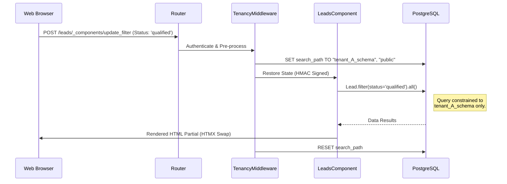

# Task 11: The Enterprise Gateway (MVR)

**Goal**: Seamlessly connect Models, Views, and Routes while enforcing strict physical isolation. Build a "Lead Manager" from scratch that supports both standard APIs and reactive, stateful UIs.

---

## 🏗️ Step 11.1: The Isolated Data Matrix

When building for enterprise, you need the "Gold Standard" of data privacy. In Eden, this means **Schema-Based Isolation (SBI)**. Every tenant gets a dedicated PostgreSQL schema.

**File**: `app/models/lead.py`

```python
from eden.db import Model, f
from eden.tenancy import TenantMixin
from sqlalchemy.orm import Mapped

# Inheriting from TenantMixin tells Eden to create this table 
# in EVERY tenant-specific PostgreSQL schema.
class Lead(Model, TenantMixin):
    __tablename__ = "leads_v11"
    
    name: Mapped[str] = f(max_length=255, label="Contact Name")
    email: Mapped[str] = f(max_length=255, index=True)
    company: Mapped[str] = f(max_length=255, nullable=True)
    status: Mapped[str] = f(default="new", label="Lead Status")
```

> [!IMPORTANT]
> **Zero Leakage**: All queries to `Lead` will automatically be scoped by the `TenancyMiddleware` to the active tenant's schema path. You can never accidentally query another tenant's leads.

---

## 🏎️ Pattern A: The Robust Route (Standard MVC)

The standard Model-View-Router (MVR) pattern is best for clean, RESTful APIs and classic multi-page applications.

**File**: `app/routes/leads.py`

```python
from eden.routing import Router
from eden.db import Model, f
from eden.tenancy import TenantMixin
from sqlalchemy.orm import Mapped

# Define model within the context for demonstration
class Lead(Model, TenantMixin):
    __tablename__ = "leads_mvc"
    name: Mapped[str] = f(max_length=255)
    email: Mapped[str] = f(max_length=255)
    company: Mapped[str] = f(max_length=255, nullable=True)

leads_router = Router(prefix="/leads")

@leads_router.get("/")
async def list_leads(request):
    """List leads for the active tenant."""
    leads = await Lead.all()
    return {"leads": [l.to_dict() for l in leads]}

@leads_router.post("/create")
async def create_lead(request):
    """Create a new lead."""
    form = await request.form()
    lead = await Lead.create(
        name=form["name"],
        email=form["email"],
        company=form.get("company")
    )
    return {"success": True, "lead_id": lead.id}
```

---

## ✨ Pattern B: The Elite Component (Stateful UI)

For a premium, interactive user experience, use Eden's **Stateful Components**. They serialize their state into a signed HTMX payload, making them reactive and secure.

**File**: `app/components/leads_dashboard.py`

```python
from eden.components import Component, register, action
from eden.db import Model, f
from eden.tenancy import TenantMixin
from sqlalchemy.orm import Mapped

class Lead(Model, TenantMixin):
    __tablename__ = "leads_comp"
    name: Mapped[str] = f(max_length=255)
    status: Mapped[str] = f(default="new")

@register("leads-manager")
class LeadsManager(Component):
    template_name = "components/leads_manager.html"
    
    def __init__(self, filter_status="new", **kwargs):
        self.filter_status = filter_status
        super().__init__(**kwargs)
        
    def get_context_data(self, **kwargs):
        ctx = super().get_context_data(**kwargs)
        # Note: In a real app, you'd use Lead.filter(status=self.filter_status).all()
        ctx["leads"] = [] 
        return ctx

    @action
    async def update_filter(self, request, status: str):
        """Reactively update the list based on status."""
        self.filter_status = status
        return await self.render()
```

> [!TIP]
> **Component State**: Notice how `filter_status` is passed to `__init__`. Eden automatically tracks this variable and persists it across and HTMX "actions" using HMAC signatures.

---

## 🚀 Pattern C: Cross-Tenant Insights (The Control Plane)

Sometimes, a "Super Admin" needs to perform calculations across every enterprise customer (e.g., total leads in the system).

```python
from eden.tenancy import AcrossTenants, TenantMixin
from eden.db import Model, f

class Lead(Model, TenantMixin):
    __tablename__ = "leads_global"
    amount: float = f(default=0.0)

async def get_global_metrics():
    """Aggregates data across ALL database schemas safely."""
    async with AcrossTenants():
        # This will iterate through all registered tenant schemas
        total_leads = await Lead.count()
    return {"total_enterprise_leads": total_leads}
```

---

## 📊 The Enterprise Data Flow

The diagram below shows how Eden maintains strict isolation across the entire Model-View-Route stack.



---

## 🛠️ Verification & Deployment

### 1. Migrations
When you add the `Lead` model, ensure you generate the isolation-aware migration:

```bash
eden db migrate generate -m "add_leads_table"
eden db migrate upgrade --all-tenants
```

### 2. Implementation Check
- [ ] Model inherits from `TenantMixin`.
- [ ] Router is mounted in `app/main.py`.
- [ ] Component is registered via `@register`.

---

**Next Task**: [Native Real-Time Sync (Reactive ORM)](./task12_reactive_orm.md)
